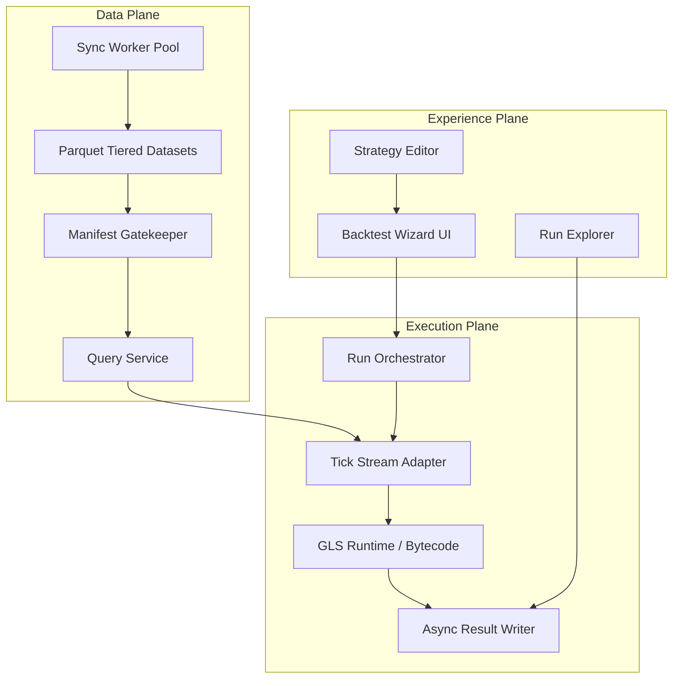

# Arquitetura Backtest v2

Este documento define a direção de evolução do `data-backtest` para ser mais rápido, mais simples de usar e com design profissional.

## Objetivo

- Reduzir o tempo de execução dos backtests sem perder a fidelidade da estratégia GLS.
- Simplificar o fluxo de uso: estratégia → dados → execução → análise em uma experiência contínua.
- Tornar a análise de resultados profissional, com visão consolidada, filtros e comparativos.

## Princípios

1. Postgres continua como fonte de verdade; o lakehouse é derivado e reconstruível.
2. Separar claramente: Data Plane, Execution Plane e Experience Plane.
3. O Backtest Studio não deve depender de leitura direta do Postgres para execução.
4. Priorizar métricas de sucesso: ticks/s, time-to-first-result, cliques até o primeiro backtest, tempo de prepare.

## Arquitetura alvo

## Camadas

### Data Plane
- Sync incremental de dados derivados.
- Manifest como gatekeeper de disponibilidade.
- Dataset tiered: `backtest_ticks_lite`, `backtest_ticks` e cache de charts.

### Execution Plane
- Orquestração de runs com fila e execução assíncrona.
- Tick provider unificado (DuckDB hoje; Postgres/Hybrid futuramente).
- Runtime GLS com compilação em etapas (interpretado → bytecode/compilado).

### Experience Plane
- Wizard em uma única tela para rodar backtests.
- Explorer de runs com comparador, filtros e visão detalhada.
- Drawer de evento para gráfico BTC vs PTB, logs e diagnósticos.

## Contratos principais

- `TickProvider`: abstrai leitura de dados e projeção de colunas.
- `StrategyRunner`: executa a estratégia GLS com compatibilidade de paridade.
- `RunResultStore`: grava summary, traces e chart cache.

## Roadmap de evolução

- Fase R0: quick wins de performance e UI.
- Fase R1: compilação/bytecode + prefetch de batches.
- Fase R2: UX de estúdio e comparador de runs.
- Fase R3: cache de dataset e worker dedicado.
- Fase R4: refinamento, design system e otimização contínua.

## Métricas norte-star

- Ticks/s por run.
- Time-to-first-result.
- Cliques até o primeiro backtest.
- Tempo de prepare/availability.
- Pico de RAM e estabilidade em runs longos.

## Relação com a documentação existente

- A documentação histórica continua em [docs/](docs/).
- Este arquivo é a visão de evolução futura para o projeto.
