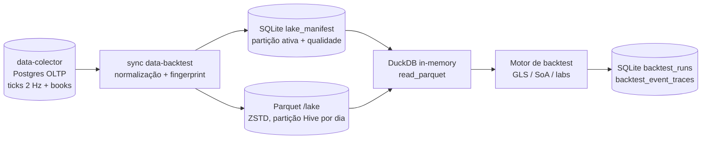

# Dicionário de Dados do Lakehouse (para mineração quantitativa BTC 5m)

Referência canônica de **como os dados são armazenados** no `data-backtest` e de como
consumi-los para pesquisa de padrões, anomalias e estratégias. Este documento é o
par de dados do
[guia-sistema-descoberta-padroes.md](guia-sistema-descoberta-padroes.md).

> Em divergência entre este documento e o código, vale o código. Fontes primárias:
> `src/sync/duckdbParquet.js` (schemas), `src/lake/paths.js` (layout),
> `src/query/duckdbQuery.js` (leitura), `src/state/sqlite.js` (estado).

---

## 1. Visão geral da arquitetura de dados



Três camadas de persistência:

| Camada | Tecnologia | Conteúdo | Caminho |
|---|---|---|---|
| Lakehouse | Parquet (ZSTD) | Ticks, books, OHLC — dados imutáveis por dia | `LAKE_ROOT` (local `./lake`, prod `/lake`) |
| Estado | SQLite (WAL) | Manifest, jobs, estratégias, runs, traces | `STATE_DB_PATH` (local `./state/data-backtest.db`) |
| Fonte | PostgreSQL | Verdade OLTP do coletor (read-only aqui) | `DATA_COLLECTOR_DATABASE_URL` |

O DuckDB roda **in-memory** (`src/query/duckdbPool.js`): não há views persistentes;
toda leitura é `read_parquet([...paths])` com a lista de arquivos resolvida pelo
manifest.

### Regra de ouro do manifest

Backtests e mineradores **nunca** devem usar glob no filesystem. A lista de Parquet
válidos vem de `lake_manifest` (status `valid` ou `accepted`), resolvida por
`src/query/availability.js`. Um mesmo dia pode ter vários `part-*.parquet` no disco
(gerações antigas); só o `active_path` conta.

---

## 2. Layout físico do lake

```text
/lake/
  scalars/          underlying=BTC/interval=5m/dt=2026-05-31/part-<run-id>.parquet
  books/            underlying=BTC/interval=5m/dt=2026-05-31/part-<run-id>.parquet
  backtest_ticks/   underlying=BTC/interval=5m/book_depth=25/dt=2026-05-31/part-<run-id>.parquet
  backtest_ticks_lite/  (mesmo path de scalars; sem colunas de book)
  ohlc/             resolution=1m/underlying=BTC/interval=5m/dt=2026-05-31/part-<run-id>.parquet
  features/         (reservado — ainda sem dataset; candidato natural para o cubo de features)
  manifests/        snapshots exportados (fonte de verdade = SQLite)
  .tmp/             escrita temporária antes da publicação atômica
```

- Partição lógica: `underlying` + `interval` + `dt` (dia UTC). `backtest_ticks`
  adiciona `book_depth=N`; `ohlc` adiciona `resolution` (1s | 5s | 1m | 5m).
- Publicação atômica: escreve em `.tmp` → valida → rename → atualiza
  `lake_manifest.active_path` (`src/sync/*.js`).
- Intervalos suportados: `5m`, `15m`, `1h`, `4h` (`src/source/postgres.js`). O foco
  da pesquisa é `interval=5m`.

### Volumetria local (medida em 2026-07-02)

| Underlying | Dataset | Dias | Range | Tamanho |
|---|---|---:|---|---|
| BTC | `backtest_ticks` depth 25 | 66 | 2026-04-23 → 2026-06-27 | ~2,5 GB |
| ETH | `backtest_ticks` depth 25 | 25 | 2026-05-24 → 2026-06-17 | — |
| SOL | `backtest_ticks` depth 25 | 35 | 2026-05-24 → 2026-06-27 | — |
| XRP | `backtest_ticks` depth 25 | 14 | 2026-06-01 → 2026-06-14 | — |

Ordem de grandeza BTC 5m: ~180k ticks/dia, ~11–14 mil eventos e ~8–9,5 M ticks em
janelas de 40–53 dias (ver `validacao-payout-divergencia.md`). Para atualizar o lake
local a partir do Brutus: `npm run lake:pull`.

---

## 3. Datasets e schemas

### 3.1 `backtest_ticks` — o dataset da mineração

É o dataset principal para descoberta de padrões: escalares + book flattenado top-N
por lado. Schema definido em `src/sync/duckdbParquet.js` (linhas ~305–336).

Colunas escalares (idênticas em `scalars` e `backtest_ticks_lite`):

| Coluna | Tipo | Semântica |
|---|---|---|
| `market_id` | VARCHAR | Mercado no data-colector (ex.: BTC crypto-updown-5m) |
| `underlying` | VARCHAR | `BTC`, `ETH`, `SOL`, `XRP`, … |
| `interval` | VARCHAR | `5m` (janela do evento) |
| `condition_id` | VARCHAR | **Identificador do evento** (contrato Polymarket). Chave de agrupamento por evento |
| `event_start` / `event_end` | VARCHAR (ISO UTC) | Janela do evento; `event_end` é o settlement. τ = `event_end − ts` |
| `ts` | VARCHAR (ISO UTC) | Timestamp do tick. Cadência nominal do coletor: **2 Hz (1 tick/500 ms)** |
| `underlying_price` | DOUBLE | Spot do ativo no tick (alias legado `btc_price`) |
| `price_to_beat` | DOUBLE | **Strike/PTB** — preço de referência do settlement |
| `up_price` / `down_price` | DOUBLE | Preço mid dos tokens UP/DOWN (probabilidade implícita) |
| `up_best_bid` / `up_best_ask` | DOUBLE | Topo do book do token UP |
| `down_best_bid` / `down_best_ask` | DOUBLE | Topo do book do token DOWN |
| `coverage` | DOUBLE | Cobertura de coleta do evento (`event_quality`), 0–1 |
| `degraded` | BOOLEAN | Flag de qualidade operacional do tick/evento |
| `book_depth` | INTEGER | Profundidade N exportada (tipicamente 25) |

Colunas de book (para cada `side` em `up_ask`, `up_bid`, `down_ask`, `down_bid` e
cada nível `i` de 1 a N):

| Coluna | Tipo | Semântica |
|---|---|---|
| `<side>_px_<i>` | DOUBLE | Preço do nível i (1 = topo do book) |
| `<side>_sz_<i>` | DOUBLE | Quantidade (shares) disponível no nível i |

Com depth 25 são `18 + 4×25×2 = 218` colunas. **Sempre projete apenas as colunas
necessárias** — ler tudo estoura heap do V8 em janelas longas.

### 3.2 `scalars`

Mesmo conteúdo escalar do `backtest_ticks`, sem book e sem `book_depth`. Fonte para
o OHLC e para preview. Para mineração use `backtest_ticks` (tem tudo) ou
`backtest_ticks_lite` quando o sinal não usa book além do topo.

### 3.3 `backtest_ticks_lite`

Derivado do `backtest_ticks` via `SELECT` das colunas escalares
(`src/sync/backtestTicksLite.js`). Ideal para varreduras que só precisam de
spot/PTB/best bid-ask: leitura muito mais rápida e leve.

### 3.4 `books`

Books completos como JSON serializado em VARCHAR (`up_book_asks`, `up_book_bids`,
`down_book_asks`, `down_book_bids`). Use apenas quando precisar de profundidade
além do top-25 — o parse de JSON por tick é caro.

### 3.5 `ohlc`

Agregação por bucket sobre `scalars` (`src/sync/duckdbParquet.js` linhas ~127–173),
nas resoluções `1s`, `5s`, `1m`, `5m`:

| Coluna | Semântica |
|---|---|
| `bucket_ts`, `resolution` | Início do bucket (VARCHAR de TIMESTAMP) e resolução |
| `open/high/low/close_underlying` | OHLC do spot |
| `open/high/low/close_up`, `..._down` | OHLC dos preços UP/DOWN |
| `price_to_beat` | Primeiro PTB do bucket |
| `ticks_count` | Nº de ticks agregados no bucket |

Útil para features de contexto (volatilidade realizada por minuto, regime do dia)
sem varrer ticks brutos.

### 3.6 O que NÃO está no Parquet

- **Resultado oficial do settlement Polymarket**: não existe coluna de outcome. O
  vencedor é **inferido** no último tick do evento:
  `winnerSide = underlying_price > price_to_beat ? 'UP' : 'DOWN'`
  (`src/backtestStudio/gls/orderSimulator.js`, `settleEventPnl`).
- **Resultados de backtest**: ficam no SQLite (`backtest_runs`,
  `backtest_event_traces`) — ver §6.
- **Features derivadas**: o diretório `features/` está reservado, mas vazio.

---

## 4. Semântica de domínio — evento BTC 5m

- Um "evento" é um mercado Polymarket **crypto up/down de 5 minutos**: no
  `event_end`, se o spot fechar **acima** do `price_to_beat`, UP paga $1.00/share;
  senão, DOWN paga $1.00/share.
- Um dia tem até 288 eventos por underlying (12/hora). Chave: `condition_id`.
- Grandezas derivadas padrão da pesquisa:
  - `dist = underlying_price − price_to_beat` (assinada) e `|dist|` em USD;
  - `τ = event_end − ts` em segundos (300 → 0);
  - `fav` = lado líder (`UP` se `dist > 0`, senão `DOWN`);
  - `odds sum = up_best_ask + down_best_ask` (≈ 1.00–1.04 em book saudável);
  - probabilidade física Browniana:
    `P_phys = Φ(dist / (σ_real · √τ))`, com σ realizada em janela recente.
- **Custos reais** (obrigatórios em qualquer avaliação de edge):
  - taxa taker Polymarket crypto: `fee = shares × 0.07 × price × (1 − price)`
    (`src/backtest/fees.js`);
  - execução por **varredura do book** nível a nível, nunca pelo `best_ask`
    isolado — metodologia formalizada em
    [validacao-payout-divergencia.md](validacao-payout-divergencia.md) §1.1.

---

## 5. Qualidade dos dados — o que já foi tratado e o que ainda pode enviesar

Tratado na ingestão (`src/sync/applyNormalization.js`, `src/quality/normalizeEvent.js`):

- Detecção de `clob_stale` (book congelado) e `underlying_stale` (spot congelado).
- Evento inteiro é **omitido** do export se > 50% dos ticks forem ruins
  (`SYNC_NORMALIZE_OMIT_EVENT_RATIO`). Relatório em
  `lake_manifest.quality_details_json`.
- Exclusões manuais por `condition_id` em `event_exclusions` (SQLite).

Filtros aplicados na leitura quando `validBacktestRows: true`
(`src/query/duckdbQuery.js`, `buildTicksSql`):

```sql
underlying_price IS NOT NULL
AND price_to_beat IS NOT NULL
AND price_to_beat > 1000  -- minSpotUsd('BTC'); ETH 100, SOL 10, XRP 0.1
```

O que o minerador ainda precisa tratar por conta própria:

| Risco | Mitigação |
|---|---|
| Ticks com book vazio/parcial (`*_px_1` NULL) | Filtrar `up_best_ask IS NOT NULL AND down_best_ask IS NOT NULL` |
| `coverage` baixo distorce features de janela | Exigir `coverage >= 0.9` (ou sensibilidade ao corte) |
| `degraded = true` | Excluir ou analisar separadamente |
| Gaps de ticks dentro do evento | Features de janela devem tolerar amostragem irregular (usar tempo, não contagem de ticks) |
| Look-ahead | Só usar dados com `ts` estritamente anterior ao instante da decisão; nunca usar o último tick para decidir e liquidar ao mesmo tempo |

---

## 6. Estado SQLite relevante para pesquisa

Arquivo `STATE_DB_PATH` (schema em `src/state/sqlite.js`):

| Tabela | Uso na pesquisa |
|---|---|
| `lake_manifest` | Descobrir dias disponíveis, `rows`, `events_count`, `coverage_min`, `has_degraded`, status por partição |
| `backtest_runs` | Summary + `result_json` completo de cada run (equity, events, log) |
| `backtest_event_traces` | Trace por evento: side, entradas/saídas, `final_pnl`, `result` (`win`/`loss`), `reason`, orders/marks/metrics JSON — ótimo para post-mortem de estratégias |
| `event_exclusions` | Eventos banidos manualmente |
| `strategy_definitions` / `strategy_versions` | Estratégias GLS/JS versionadas do Studio |

Cache colunar de re-run (não é Parquet): `state/dataset-cache/` com blocos binários
`GLCS` (`src/backtest/datasetDiskStore.js`) — transparente para quem usa o engine.

---

## 7. Como consumir os dados

### 7.1 Via API interna (recomendado para mineradores Node)

```js
import { openStateDb } from './src/state/sqlite.js';
import { queryTicks, openBacktestTickSession, backtestTickSelectColumns } from './src/query/duckdbQuery.js';

const db = openStateDb();

// Carga completa (janelas curtas)
const rows = await queryTicks(db, {
  dataset: 'backtest_ticks',
  underlying: 'BTC', interval: '5m', bookDepth: 25,
  from: '2026-05-04T00:00:00Z', to: '2026-05-05T00:00:00Z',
  validBacktestRows: true,
  select: 'condition_id, event_end, ts, underlying_price, price_to_beat, up_best_ask, down_best_ask',
});

// Streaming (janelas longas — não materializa milhões de linhas)
const session = await openBacktestTickSession(db, {
  underlying: 'BTC', interval: '5m', bookDepth: 25,
  from: '2026-05-04T00:00:00Z', to: '2026-06-27T00:00:00Z',
  validBacktestRows: true,
  selectColumns: ['condition_id', 'event_end', 'ts', 'underlying_price', 'price_to_beat'],
  includeBook: true, selectBookDepth: 5, // projeta só os 5 primeiros níveis
});
let offset = 0;
for (;;) {
  const batch = await session.readBatch(offset, 50_000);
  if (!batch.length) break;
  // ... processar (batch[i]._tsMs, _eventEndMs já vêm como epoch ms)
  offset += batch.length;
}
session.close();
```

Para o hot path colunar (TypedArrays, sem objetos por linha), ver
`src/query/columnChunkReader.js` e `src/backtest/columnStore.js` (motor
`BACKTEST_ENGINE=soa`).

### 7.2 Via CLI

```powershell
npm run query:availability -- --dataset backtest_ticks --underlying BTC --interval 5m --from 2026-05-04 --to 2026-06-27
npm run query:ticks -- --underlying BTC --interval 5m --from 2026-05-04T00:00:00Z --to 2026-05-04T01:00:00Z
npm run backtest:run -- ...
```

### 7.3 Via DuckDB direto (exploração ad hoc)

Aceitável para exploração pontual, **desde que** a lista de arquivos venha do
manifest (`npm run query:resolve` ou leitura de `lake_manifest`). Exemplo de
consulta agregada por evento:

```sql
SELECT condition_id,
       any_value(event_end) AS event_end,
       max_by(underlying_price, ts) AS last_spot,
       any_value(price_to_beat) AS ptb,
       max_by(underlying_price, ts) > any_value(price_to_beat) AS up_won
FROM read_parquet(['...part-xxx.parquet', '...'])
WHERE underlying_price IS NOT NULL AND price_to_beat > 1000
GROUP BY condition_id;
```

### 7.4 Armadilhas de leitura

- `ts`, `event_start`, `event_end` são **VARCHAR ISO**, não TIMESTAMP. Para
  comparação lexicográfica ISO UTC funciona, mas para aritmética use
  `TRY_CAST(ts AS TIMESTAMP)` (é o que `backtestColumnSetSelectColumns` faz).
- `ticks_count` do OHLC volta como BIGINT (o wrapper `jsonSafeRow` converte).
- A ordenação canônica é `ORDER BY ts ASC, condition_id ASC`. Eventos 5m do mesmo
  mercado são sequenciais, mas underlyings diferentes compartilham a mesma
  timeline — sempre filtre por `underlying` na partição e agrupe por
  `condition_id` ao calcular features de evento.
- Dedup: o export é idempotente por partição, mas se você misturar `active_path`
  com arquivos antigos do mesmo dia terá linhas duplicadas — mais um motivo para
  nunca usar glob.

---

## 8. Referências cruzadas

| Tema | Documento |
|---|---|
| Blueprint do sistema de descoberta | [guia-sistema-descoberta-padroes.md](guia-sistema-descoberta-padroes.md) |
| Metodologia de payout real (varredura + fee) | [validacao-payout-divergencia.md](validacao-payout-divergencia.md) |
| Registro de anomalias mineradas | [catalogo-anomalias.md](catalogo-anomalias.md) |
| Prompt do loop autônomo de mineração | [../prompts/prompt-loop-minera-anomalias.md](../prompts/prompt-loop-minera-anomalias.md) |
| Arquitetura do lakehouse (fases, manifest) | [../arquitetura/arquitetura-lakehouse-backtest.md](../arquitetura/arquitetura-lakehouse-backtest.md) |
| Qualidade/normalização de eventos | [../arquitetura/arquitetura-qualidade-eventos.md](../arquitetura/arquitetura-qualidade-eventos.md) |
| Labs (sweeps, presets, Brutus) | [../referencia/guia-criacao-e-teste-de-laboratorios.md](../referencia/guia-criacao-e-teste-de-laboratorios.md) |
