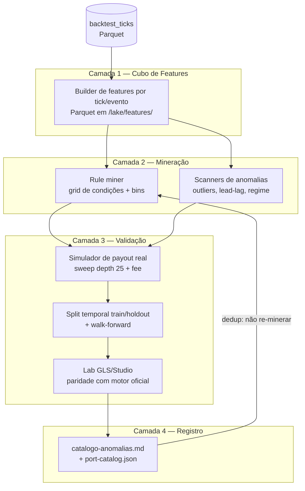

# Sistema de Descoberta de Padrões e Anomalias — BTC 5m

Blueprint para construir (e operar) um sistema sistemático de descoberta de
padrões, anomalias e informação exploitável nos mercados Polymarket crypto
up/down de 5 minutos, sobre o lakehouse do `data-backtest`.

Par de dados deste documento:
[dicionario-dados-lakehouse.md](dicionario-dados-lakehouse.md) (onde e como os
dados estão armazenados). Registro vivo dos resultados:
[catalogo-anomalias.md](catalogo-anomalias.md). Loop operacional:
[../prompts/prompt-loop-minera-anomalias.md](../prompts/prompt-loop-minera-anomalias.md).

---

## 1. O problema em uma frase

Encontrar condições observáveis no tick t (spot, PTB, odds, book, tempo restante,
histórico da janela) tais que comprar UP ou DOWN naquele instante tenha
**expectativa líquida positiva por trade após varredura real do book (depth 25) e
taxa taker de `0.07 × price × (1 − price)` por share**, com robustez fora da
amostra e frequência suficiente para importar.

### O que os dados permitem saber em cada tick

| Dimensão | Colunas / derivação |
|---|---|
| Física do spot | `underlying_price`, deltas em janelas (5s, 10s, 15s, 30s, 60s), velocidade, aceleração, volatilidade realizada |
| Barreira | `price_to_beat`, `dist = spot − PTB`, cruzamentos (flips), tempo desde o último flip |
| Tempo | `τ = event_end − ts` (300 → 0 s), fase do evento (início/meio/terminal) |
| Odds (probabilidade implícita) | `up_price`, `down_price`, `up/down_best_bid/ask`, spread, odds sum, deltas de odds em janelas |
| Microestrutura do book | `*_px_1..25`, `*_sz_1..25`: profundidade por lado, imbalance, inclinação da ladder, custo efetivo de varredura para um orçamento B |
| Modelo teórico | `P_phys = Φ(dist / (σ_real·√τ))` vs preço de mercado → mispricing |
| Resultado (label) | vencedor inferido no último tick: `spot > PTB ⇒ UP` |

### Restrições econômicas que definem o jogo (validadas empiricamente)

Lições consolidadas de 36+ anomalias testadas (ver catálogo):

1. **A taxa taker de 0.07 mata quase tudo.** Win rate alto não basta: A2/ODR tinha
   82% de WR e expectativa de apenas +$0.04/trade; sinais com 60–75% de WR e
   entrada cara são consistentemente negativos.
2. **Duas pernas taker (entrar e sair) quase nunca fecham a conta.** Fee dupla de
   ~0.14/share destrói micro-horizontes (ANOM-03B: 11.8% de WR útil).
   **Hold-to-settlement é o formato padrão** — elimina a fee de saída.
3. **Odds de cauda (< 0.20) não pagam**: a fee é proporcionalmente enorme e a taxa
   de acerto real é ~10% (ANOM-05).
4. **Odds caras (> 0.85) não pagam**: payoff assimétrico desfavorável (ganha 0.08,
   perde 0.92) engole o edge (ANOM-04).
5. **A zona fértil de entrada é `0.35 ≤ ask efetivo ≤ 0.65`**, onde os padrões
   promovidos vivem (Whipsaw Lock, SBRI, TAT, ANOM-34).
6. **Frequência alta + edge pequeno = ruína**; os campeões têm 2–30 trades/dia com
   +$1.5 a +$17/trade, não centenas de trades com centavos.
7. **O book é eficiente na média** — o edge só existe em janelas curtas de
   *repricing lag*: pós-cruzamento do strike (SBRI/TAT), pós-whipsaw (ANOM-22),
   inércia no início do evento (LIM), drift terminal confirmado (ANOM-26).

Qualquer minerador novo deve embutir essas restrições como priors, não
redescobri-las.

---

## 2. Arquitetura do sistema

Quatro camadas, todas em cima do lakehouse existente:



### Camada 1 — Cubo de features (a peça que falta construir)

Hoje cada minerador (`scratch/*.js`, mineradores ad hoc citados no catálogo como
`mine-anomaly-cube.js`) recalcula features a partir dos ticks brutos a cada
execução. A melhoria estrutural é **materializar um dataset `features` no lake**
(o diretório `/lake/features/` já está reservado em `src/lake/storage.js`):

- **`features_tick`** — uma linha por tick de decisão (cadência sugerida: 1–5 s),
  particionada como `scalars` (`underlying=BTC/interval=5m/dt=...`). Colunas:
  - identidade: `condition_id`, `ts`, `tau`;
  - físicas: `dist`, `dist_abs`, `delta_spot_{5,10,15,30,60}s`, `vel_10s`,
    `accel_10s`, `sigma_{30,60,90}s`, `flips_60s`, `secs_since_flip`,
    `range_60s`, `pin_ratio_45s` (fração de ticks com `|dist| ≤ 8`);
  - odds: `fav_side`, `ask_fav`, `bid_fav`, `spread_fav`, `odds_sum`,
    `delta_ask_fav_{10,15,30}s`, `sigma_ask_15s`, `mid_up`;
  - book: `depth_ask_fav_5`, `depth_bid_fav_5`, `obi_5` (imbalance),
    `ladder_slope_fav` (`px_5 − px_1`), `avg_fill_10usd_fav`
    (preço efetivo com fee para orçamento $10 — a feature mais importante);
  - modelo: `p_phys` (Normal CDF com σ realizada), `edge_phys = p_phys − ask_fav`;
  - labels: `winner_side`, `fav_won`, `pnl_10usd_fav`, `pnl_10usd_nonfav`
    (PnL líquido hold-to-settlement do trade hipotético de $10 em cada lado —
    pré-calculado uma única vez, com sweep + fee).
- **`features_event`** — uma linha por evento: OHLC do spot no evento, nº de
  flips, tempo líder de cada lado, coverage, vencedor, hora do dia, regime de
  volatilidade do dia. Base para análise de sazonalidade e regime.

Com os **labels de PnL pré-calculados**, qualquer hipótese vira uma consulta
DuckDB agregada de segundos, em vez de um replay de 9 M de ticks:

```sql
SELECT count(*) AS n,
       avg(fav_won::INT) AS wr,
       sum(pnl_10usd_fav) AS pnl,
       avg(pnl_10usd_fav) AS exp_trade
FROM read_parquet([...features_tick...])
WHERE tau BETWEEN 35 AND 160
  AND flips_60s >= 3
  AND dist_abs >= 22
  AND ask_fav <= 0.57 AND spread_fav <= 0.025
-- 1 entrada por evento: aplicar QUALIFY row_number() OVER (PARTITION BY condition_id ORDER BY ts) = 1
```

Regras do builder:

- Features de janela usam **tempo, não contagem de ticks** (amostragem é
  irregular; cadência nominal 2 Hz mas com gaps).
- **Nenhum look-ahead**: toda feature no tick t usa apenas `ts' < t`. Os labels
  são a única coluna "do futuro" e devem ser tratados como tal.
- Aplicar os mesmos filtros de qualidade do engine (`validBacktestRows`,
  `coverage ≥ 0.9`, `degraded = false`, books não nulos).
- Registrar a partição no `lake_manifest` (dataset novo `features_tick`) para
  herdar o fluxo de staleness (se `backtest_ticks` do dia mudar, refazer).

### Camada 2 — Mineração

Dois motores complementares sobre o cubo:

1. **Rule miner (grid discreto)** — o método que já produziu os campeões:
   discretizar cada feature em bins (ex.: `tau` em fases, `dist_abs` em faixas de
   $8–15–22–35–60–100, `ask_fav` em faixas de 0.05), enumerar conjunções de 2–4
   condições, computar `n / WR / exp_trade` por célula via SQL agregado, e ranquear
   por expectativa no **train** com `n ≥ 50`. É barato com labels pré-calculados
   (milhões de células por minuto no DuckDB).
2. **Scanners dirigidos por hipótese** — detectores específicos de microestrutura
   que o grid não expressa bem: lead-lag odds→spot (ODR), sequências (flip → calma
   → definição, o mecanismo do Whipsaw Lock), assimetrias por regime
   (acima/abaixo do PTB), clusters por hora do dia/dia da semana, mudanças de
   regime de σ, comparação entre underlyings (BTC vs ETH vs SOL — o mesmo padrão
   generaliza?).

Regra de **dedup obrigatória** antes de promover qualquer célula: conferir
`labs/strategies/` + `labs/strategies/_catalog/port-catalog.json` + catálogo de
anomalias. Mecanismo já coberto ⇒ `Descartado — duplicata`.

### Camada 3 — Validação (funil de 4 estágios)

| Estágio | Ferramenta | Critério para avançar |
|---|---|---|
| V1 Grid train | SQL no cubo (train = primeiros ~60% dos dias) | `exp_trade > 0` líquido, `n ≥ 50`, mecanismo explicável |
| V2 Holdout | Mesma query no holdout temporal fixo (~40% finais) | Expectativa positiva e WR estável (±10 p.p. do train); sem dependência de outliers (mediana e trimmed mean também positivas) |
| V3 Lab GLS | Port para `labs/strategies/<family>/<id>/` + `npm run lab:run` com `BACKTEST_ENGINE=soa` | Paridade de mecânica no motor oficial (fills reais, fees, traces); PF ≥ 1.3 e DD tolerável |
| V4 Studio + walk-forward | Preset no Backtest Studio, janelas móveis, sweep de sensibilidade | Edge sobrevive a perturbação de parâmetros (±20% nos cortes) e a janelas novas de dados |

Só entra no catálogo como **Promovido** quem passa V3; só vira candidato a robô
real quem passa V4.

### Camada 4 — Registro e governança

- Toda hipótese testada (inclusive rejeitada) vira entrada no
  [catalogo-anomalias.md](catalogo-anomalias.md) no formato padrão (fórmula do
  sinal, espaço-temporal, estatísticas, análise microestrutural).
- Promovidos ganham doc em `docs/estrategias/implementadas/` e entrada no
  `port-catalog.json`, seguindo o fluxo existente de port para o Studio.
- Mineradores e builders ficam versionados (sugestão: `labs/mining/` em vez de
  `scratch/`, que é efêmero e já perdeu scripts citados no catálogo, como
  `mine-anomaly-cube.js`).

---

## 3. Protocolo anti-overfitting (inegociável)

O grid testa milhares de células — sem disciplina, sempre "acha" algo. Regras:

1. **Split temporal fixo e imutável** durante um ciclo de mineração (ex.: train
   `2026-04-23 → 2026-05-31`, holdout `2026-06-01 → 2026-06-27`). O holdout é
   tocado **uma vez** por hipótese; se falhar, a hipótese morre (não iterar
   parâmetros contra o holdout — foi o erro que quase promoveu a ANOM-13).
2. **n mínimo**: ≥ 50 sinais no train e ≥ 30 no holdout. Amostras menores só como
   "Sob Análise" aguardando mais dados (caso ANOM-35).
3. **Robustez a outliers**: reportar mediana e média aparada de PnL/trade; um
   padrão sustentado por 3 trades gigantes é ruído (caso ANOM-31).
4. **Sensibilidade de parâmetros**: perturbar cada corte em ±20% — o edge deve
   degradar suavemente, não desaparecer (plateaus, não picos).
5. **Correção de múltiplos testes**: com k células testadas, exigir significância
   maior (na prática: só levar a V2 o top-N por mecanismo, não por métrica; e
   preferir células vizinhas consistentes a células isoladas).
6. **Mecanismo antes de métrica**: toda promoção exige explicação microestrutural
   plausível (quem está do outro lado do trade e por que ele aceita perder).
7. **Uma entrada por evento** na estatística (evita pseudo-replicação de sinais
   correlacionados dentro do mesmo evento).
8. **Custos sempre**: nenhuma métrica intermediária pode ser reportada sem sweep
   de book + fee. Edge bruto não existe como conceito neste projeto.

---

## 4. Backlog de veios ainda não minerados

Direções com dados disponíveis e pouca ou nenhuma exploração registrada:

| Veio | Dados | Observação |
|---|---|---|
| Sazonalidade intradiária | `features_event` + hora UTC | Fees/spreads e vol variam por sessão (Ásia/Europa/EUA); nenhum padrão promovido condiciona por hora |
| Regime de volatilidade diário | OHLC 1m/5m do dia | Campeões podem ser regime-dependentes; σ do dia como filtro de ativação |
| Cross-underlying | BTC vs ETH vs SOL vs XRP | Validar se padrões promovidos em BTC generalizam (evidência de mecanismo) ou não (evidência de idiossincrasia) |
| Dinâmica da ladder profunda (níveis 6–25) | `*_px/sz_6..25` | Quase toda mineração usou top-5; paredes profundas e ladder slope são pouco exploradas (ANOM-36 foi só um primeiro corte) |
| Sequências entre eventos | `features_event` encadeado | O resultado/percurso do evento anterior condiciona o seguinte? (momentum/mean-reversion de 5 em 5 min) |
| Interação de padrões promovidos | traces em `backtest_event_traces` | Whipsaw Lock + TAT + SBRI disparam em regimes disjuntos? Portfólio de padrões com correlação de PnL |
| Lead-lag Binance | requer feed externo | Já há estudo (`estudo-correlacao-binance-polymarket.md`); integrar spot Binance ao cubo é upgrade de dados, não de minerador |

---

## 5. Roadmap de implementação

| Fase | Entrega | Descrição |
|---|---|---|
| D0 | Convenções | Criar `labs/mining/` versionado; congelar split train/holdout do ciclo; este doc como contrato |
| D1 | Builder do cubo | `features_tick` + `features_event` em `/lake/features/`, registrado no manifest, com labels de PnL pré-calculados (sweep + fee), cadência 1–5 s configurável |
| D2 | Rule miner | Grid engine SQL sobre o cubo com bins padrão, dedup automático contra port-catalog, saída ranqueada com train/holdout |
| D3 | Scanners | Detectores de sequência (flips, lead-lag, regime) que emitem candidatos para o grid refinar |
| D4 | Ponte de validação | Gerador semiautomático de lab GLS a partir de uma célula do grid (template de estratégia + preset + experimento) |
| D5 | Relatórios | Página/relatório por ciclo: células testadas, sobreviventes, curva train vs holdout, atualização do catálogo |

Dependências práticas: o builder D1 deve rodar tanto local quanto no **Brutus**
(sweeps grandes já rodam lá — ver `labs/ops/brutus/`); o cubo BTC 5m de 66 dias
tem ordem de ~2–4 M de linhas na cadência de 5 s, tranquilo para Parquet + DuckDB.

---

## 6. Critérios de promoção (resumo executivo)

Um padrão vira **estratégia candidata** quando, com sweep depth 25 + fee 0.07,
hold-to-settlement, uma entrada por evento:

- expectativa líquida ≥ **+$1.00/trade** (orçamento $10) no train **e** no holdout;
- n ≥ 50 (train) e ≥ 30 (holdout); WR estável entre splits;
- profit factor ≥ 1.3 no lab GLS; drawdown compatível com o sizing;
- turnover ≥ ~2 trades/dia (senão é curiosidade estatística, não estratégia);
- mecanismo microestrutural explicável e não duplicado do catálogo;
- sobrevive a ±20% de perturbação nos parâmetros.

Benchmarks internos do que "bom" significa: Whipsaw Lock (+$13.6/trade, 1.1/dia),
SBRI tight (+$17.8/trade, 2.2/dia), TAT (+$1.57/trade, 32/dia), ANOM-34
(+$1.57/trade, 3/dia, pendente GLS).
