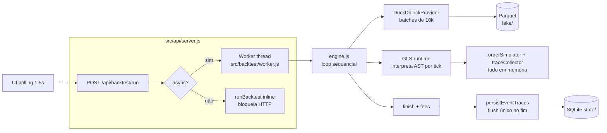
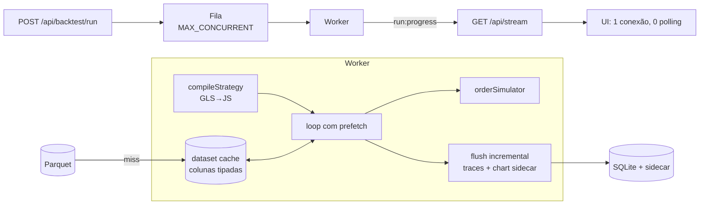

# Arquitetura V2 — Backtest rápido, UX de estúdio e design profissional

> Status: **implementado** (jun/2026) — motor (compilador GLS, prefetch, fila, SSE,
> traces incrementais) e Estúdio entregues. A evolução seguinte (Estúdio como tela
> única, simplificação da view Dados e biblioteca de estratégias) está em
> [arquitetura-v3-consolidacao-ux.md](arquitetura-v3-consolidacao-ux.md), o plano
> diretor atual.
> Este documento parte de um diagnóstico concreto do código da época (arquivos e
> linhas citados) e define a arquitetura em duas frentes: **motor de backtest**
> (velocidade) e **experiência de uso** (navegação, visualização e design).

---

## 1. Contexto e objetivo

O `data-backtest` substituiu o `polymarket-test` com a promessa de ser a ferramenta
**profissional** de backtest do ecossistema GoldenLens. O lakehouse (L1–L7) e o
Backtest Studio (B1–B7) entregaram a fundação correta — Parquet/DuckDB, estratégias
GLS versionadas, traces por evento — mas dois problemas centrais permanecem:

1. **Rodar um backtest é lento.** O tempo é dominado pela interpretação da
   estratégia tick a tick e por um pipeline 100% sequencial.
2. **Usar a ferramenta é confuso e lento.** Ver o resultado de um evento exige
   3 cliques e 2 carregamentos bloqueantes; comparar dois runs exige navegar
   para frente e para trás; não há visão consolidada.

**Objetivo da V2:** rodar um backtest típico em **segundos** (não minutos) e
permitir que todo o ciclo *editar estratégia → rodar → analisar eventos →
ajustar parâmetros → rodar de novo* aconteça em **uma única tela**, sem trocar
de página, com design à altura de uma ferramenta profissional de trading.

---

## 2. Diagnóstico do estado atual

### 2.1 Pipeline atual



### 2.2 Gargalos de performance (medidos no código)

| # | Gargalo | Onde | Problema | Severidade |
|---|---------|------|----------|------------|
| P1 | **Interpretação de AST por tick** | `src/backtestStudio/gls/runtime.js` (interpreter, ~l.303–430) | Cada tick executa `interpreter.run(hook.body, ctx)`: walk recursivo do AST com `evalExpr`/`runStatement` e contador de ops. 1M ticks = 1M interpretações completas do hook `onTick`. | 🔴 Crítica — estimado 50–65% do tempo total |
| P2 | **Loop 100% sequencial, sem pipelining** | `src/backtest/engine.js` (~l.37–52) | `await iterator.next()` lê um batch, depois processa, depois lê o próximo. Leitura DuckDB e processamento JS nunca acontecem ao mesmo tempo; CPU de 1 core. | 🔴 Crítica |
| P3 | **Materialização de ~100 colunas por tick** | `src/query/duckdbQuery.js` (`backtestTickSelectColumns`, ~l.7–22) + `src/legacy/polymarketTestAdapter.js` | `SELECT` traz book depth completo (default 25 níveis × 4 colunas) e converte cada linha em objeto JS — mesmo quando a estratégia usa 2–3 níveis. | 🟠 Alta |
| P4 | **Traces inteiras em memória + flush único** | `src/backtestStudio/state/eventTraces.js` (~l.12–50), chamado por `src/state/backtestRuns.js` | Todos os eventos ficam em RAM até o fim; depois `JSON.stringify` × N eventos em uma transação. Runs longos = centenas de MB + pausa longa no fim. | 🟠 Alta |
| P5 | **Workers sem fila nem limite** | `src/api/server.js` (`startBacktestWorker`, ~l.818) | Cada `POST /api/backtest/run` async cria um Worker novo. N runs simultâneos = N workers × 4 threads DuckDB = oversubscription em container de 1–2 vCPU. | 🟠 Alta |
| P6 | **Progresso por polling** | UI (`backtests.js`, `jobs.js`) + `GET /runs/:id?slim=1` | Polling 1.5s gera latência percebida e requests redundantes. | 🟡 Média |
| P7 | **Chart de evento consultado sob demanda no DuckDB** | `GET /api/backtest/runs/:id/chart-data` | Abrir o detalhe de um evento dispara query Parquet na hora → loading visível a cada evento. A coluna `chart_series_path` já existe em `backtest_event_traces`, mas não é aproveitada. | 🟡 Média |
| P8 | **Re-run repete todo o I/O** | pipeline inteiro | Ajustar 1 parâmetro e rodar de novo relê e reconverte todos os ticks do Parquet. Não há cache de dataset entre runs. | 🟡 Média (alta para otimização de parâmetros) |

> Otimizações já feitas (não regredir): interpreter criado 1× por runner;
> `sharedCtx` reutilizado por tick; `DUCKDB_THREADS` fixo em 4 (containers cgroup
> reportam núcleos do host — não usar `os.availableParallelism`); cache de assets
> estáticos; pool Postgres compartilhado; cache 60s de `/api/context-options`.

### 2.3 Fricções de UX (medidas na UI atual)

| Tarefa | Hoje | Custo |
|--------|------|-------|
| Ver gráfico BTC vs PTB de 1 evento | Backtests → clicar run → clicar evento | 3 cliques, 2 page-loads bloqueantes |
| Analisar 10 eventos de um run | run → evento → voltar → evento… | 20+ cliques, 10 loadings |
| Comparar 2 runs | run A → voltar → run B (de memória) | impossível lado a lado |
| Ajustar parâmetro e re-rodar | voltar ao form → reconfigurar → submit → poll | contexto perdido a cada ida e volta |
| Encontrar os piores eventos | paginação manual "Carregar mais" ×N, sem sort/filtro | inviável em runs grandes |

Causas estruturais: navegação por **páginas** (hash-routes `#/backtests/:id/events/:eventId`)
onde deveria haver **painéis**; toda view bloqueia render até as APIs responderem
("Carregando…", sem skeleton); nenhum estado é preservado ao navegar; views são
strings HTML monolíticas (~2.800 linhas em `public/js/views/`) sem componentes.

---

## 3. Princípios da V2

1. **Compilar, não interpretar.** Estratégia GLS vira função JS nativa uma vez por run.
2. **Nunca bloquear: nem o event loop, nem o usuário.** Pipeline com prefetch; UI com
   skeleton + dados progressivos; push (SSE) em vez de polling.
3. **Uma tela, três painéis.** Configurar, rodar e analisar sem trocar de página.
4. **Pagar o custo uma vez.** Dataset cacheado entre runs; chart de evento
   pré-computado durante o run; resultado renderizado direto da memória.
5. **Paridade garantida por teste.** O interpretador atual vira a referência de
   paridade do compilador (mesmo papel que o legado teve para o GLS).
6. **Sem framework pesado.** Continuar no-build (ESM vanilla), mas com camada fina
   de componentes e design system documentado.

---

## 4. Motor V2 — velocidade

### 4.1 E1 — Compilador GLS → JS (maior ganho)

Substituir a interpretação por **codegen**: o AST validado (parser de
`src/backtestStudio/gls/parser.js` permanece intocado) é traduzido para código
JS e materializado com `new Function` uma vez por run.

```js
// src/backtestStudio/gls/compiler.js (novo)
export function compileStrategy(ast) {
  return {
    onTick: compileHook(ast.hooks.onTick),
    onEventStart: compileHook(ast.hooks.onEventStart),
    onEventEnd: compileHook(ast.hooks.onEventEnd),
  };
}

function compileHook(hook) {
  if (!hook?.body?.length) return null;
  const src = hook.body.map(emitStatement).join('\n');
  // ctx, lib, orders, debug: mesmos objetos que o interpreter injeta hoje
  return new Function('ctx', 'lib', 'orders', 'debug', `'use strict';\n${src}`);
}
```

- `emitStatement`/`emitExpr` espelham 1:1 a semântica de `evalExpr`/`runStatement`
  do interpreter (`runtime.js` l.303–430): mesmos operadores, mesma resolução de
  `params`, `state`, `tick`, `lib.<ns>.<fn>`, `orders.*`, `debug.*`.
- **Segurança:** o codegen só emite a partir de nós de AST já validados pelo
  parser (whitelist de identificadores e funções); literais string passam por
  `JSON.stringify`. Nenhum texto do usuário é interpolado cru — o GLS v1 não tem
  loops nem eval, então o limite de 10k ops por tick deixa de ser necessário no
  caminho compilado (mantido apenas no interpretador de referência).
- **Fallback e paridade:** o interpretador continua existindo. Um flag
  `GLS_EXECUTION=interpreter|compiled` (default `compiled`) permite dual-run.
  Os testes `tests/edgeSniperGlsParity.test.js` e `tests/gls*.test.js` ganham um
  modo que roda os dois caminhos e compara `events`, `equity` e `summary`
  byte a byte.

Ganho esperado: eliminação do walk de AST por tick — a estratégia roda na
velocidade de JS otimizado pelo V8 (inline caches, JIT). É a única mudança capaz
de atacar os 50–65% de `processMs`.

### 4.2 E2 — Pipelining leitura ⇄ processamento

Hoje (`engine.js` l.37–52) leitura e processamento se alternam. Com prefetch de
1 batch, o DuckDB lê o batch N+1 enquanto o JS processa o batch N:

```js
let pending = iterator.next();              // dispara leitura
while (true) {
  const next = await pending;
  if (next.done) break;
  pending = iterator.next();                // prefetch do próximo batch
  for (const tick of next.value) runner.processTick(tick);
}
```

Custo de implementação mínimo; esconde `duckdbReadMs` (10–15% do total) quase
por completo. Subir `DEFAULT_BATCH_SIZE` (em `src/backtest/tickProvider.js`) de
10k para 25–50k reduz overhead de round-trip por batch (manter teto de 50k já
existente; medir memória).

### 4.3 E3 — Column pruning dirigido pela estratégia

O validador GLS já conhece todas as chamadas de biblioteca da estratégia. Na
compilação, extrair o **conjunto de colunas realmente usadas** (ex.: estratégia
usa `book.depth(2)` → só 2 níveis em vez de 25) e propagar para
`backtestTickSelectColumns(bookDepth)` em `src/query/duckdbQuery.js`.

- Estratégias GLS já recebem o row "cru" (`legacy: false` no provider); o
  adaptador legado (`toLegacyBacktestTick`) fica restrito às estratégias nativas
  antigas.
- Menos colunas = menos I/O de Parquet, menos conversão DuckDB→JS, objetos
  menores e mais friendly para hidden classes do V8.

### 4.4 E4 — Persistência incremental de traces

Trocar o flush único (`persistEventTraces`, hoje chamado 1× no fim) por flush
**por lote de eventos finalizados** dentro do próprio worker:

- Ao fechar cada evento (`finalizeEvent` no runtime), enfileirar a linha
  normalizada; a cada ~200 eventos (ou ~5 MB) gravar com `BEGIN IMMEDIATE` /
  `COMMIT` no SQLite do worker.
- Benefícios: memória O(lote) em vez de O(run); o fim do run deixa de ter pausa
  longa de serialização; em caso de crash/cancel, os eventos já gravados ficam
  consultáveis (`status=partial`).
- `summary`/`equity` continuam gravados no fim em `backtest_runs` (são pequenos).

### 4.5 E5 — Fila de execução com limite + SSE

- **Fila:** novo `src/backtest/queue.js` com `MAX_CONCURRENT_BACKTESTS`
  (default 1 em produção — container de 1–2 vCPU; configurável por env). Runs
  excedentes entram como `queued` em `backtest_runs` (status já suportado pelo
  schema de `prepare_jobs`; replicar o padrão). Reaproveita o desenho do
  `src/prepare/runner.js`.
- **SSE:** endpoint `GET /api/stream` (Server-Sent Events) publica eventos
  `run:progress`, `run:completed`, `run:failed`, `job:progress`. A UI abre uma
  conexão única e elimina os pollings de 1.5s (`backtests.js`, `jobs.js`).
  Fallback automático para polling se a conexão SSE cair (proxies).

### 4.6 E6 — Cache de dataset entre runs (re-run instantâneo)

O caso de uso dominante é *rodar a mesma janela de dados várias vezes mudando
parâmetros*. Implementação atual (Fase 3):

- **Cache em disco** (`src/backtest/datasetDiskLoader.js`, `columnSetDisk.js`,
  `datasetDiskStore.js`): materialização **por partição diária UTC** em
  `{state}/dataset-cache/`. Auto-gravação em miss; subset automático por
  `_ts_ms` após concatenação (`columnSetMerge.js`).
- Invalidação lazy via `source_fingerprint` + `active_path` do `lake_manifest`.
- `DATASET_DISK_CACHE=1` (default), `DATASET_DISK_CACHE_MAX_GB` para eviction LRU.
- Cache **RAM** (`src/backtest/datasetCache.js`, `DATASET_CACHE_MAX_MB`): útil só
  dentro do mesmo processo; workers efêmeros do Estúdio não reaproveitam — em
  produção, preferir `DATASET_CACHE_MAX_MB=0` e disco.
- Re-run com mesmos dados/colunas: `duckdbReadMs ≈ 0` após materialização.
- Gestão: `GET/DELETE /api/settings/dataset-cache`, warmup via POST; CLI
  `npm run cache:dataset`; aba **Cache de backtest** em Configurações da UI.
- Pré-requisito para **otimizador de parâmetros** (grid/random search): N
  variações sobre o mesmo dataset cacheado em disco.

### 4.7 E7 — Chart de evento pré-computado

Durante o run, ao finalizar cada evento, gravar a série downsampled (BTC,
price-to-beat, up/down price; alvo ~500–1000 pontos por evento) em um sidecar
por run (`state/event-series/run-<id>.jsonl` ou Parquet) e preencher a coluna
`chart_series_path` que **já existe** em `backtest_event_traces`.

- `GET /api/backtest/runs/:id/events/:eventId` passa a devolver a série junto —
  o event drawer da UI abre **instantaneamente**, sem query DuckDB.
- A rota `chart-data` atual fica como fallback para runs antigos.

### 4.8 Pipeline V2 (visão final)



---

## 5. UX V2 — o Estúdio de painel único

### 5.1 Conceito

A navegação por páginas (`Backtests → Run → Evento`) é substituída por um
**workspace** persistente — o **Estúdio** — com três zonas que ficam sempre
visíveis. Nenhuma análise exige troca de página.

```
┌────────┬──────────────────────────────────────────────┬─────────────────────┐
│  rail  │  CONFIG (colapsável)                         │  RUNS (lateral)     │
│  nav   │  estratégia ▾  versão ▾  params  janela      │  ● #182 +$512 ✓     │
│        │  dataset: BTC 1s prof.10   [▶ Rodar  ⌘↵]     │  ○ #181 −$48  ✓     │
│  ───   ├──────────────────────────────────────────────┤  ○ #180 +$211 ✓     │
│ Estúdio│  RESULTADO do run selecionado                │  ◐ #179 67% ▓▓▓░    │
│ Estrat.│  KPIs: PnL · WinRate · MaxDD · Eventos · ⏱   │  [comparar 2+ ▸]    │
│ Dados  │  equity curve (zoom/pan)                     │                     │
│ Jobs   │  ┌─ eventos (sort/filtro/scroll infinito) ─┐ │                     │
│        │  │ #ev  lado  resultado  PnL  motivo  ⏱    │ │                     │
│        │  └──────────────────────────────────────────┘│                     │
├────────┴──────────────────────────────────────────────┴─────────────────────┤
│  EVENT DRAWER (abre ao clicar numa linha; j/k navega; Esc fecha)             │
│  gráfico BTC vs PTB c/ markers + zoom │ timeline de ordens │ diag │ logs     │
└──────────────────────────────────────────────────────────────────────────────┘
```

**Fluxos-alvo:**

| Tarefa | Hoje | V2 |
|--------|------|----|
| Rodar e ver resultado | form → submit → poll → clicar "ver detalhes" | `⌘↵` → progresso via SSE no painel de runs → resultado aparece na zona central ao concluir (auto-select) |
| Ver evento (gráfico+logs) | 3 cliques, 2 loadings | 1 clique → drawer abre instantâneo (série pré-computada, §4.7) |
| Varrer 10 eventos | 20+ cliques | `j`/`k` navega evento a evento dentro do drawer |
| Comparar runs | impossível | selecionar 2+ runs no painel lateral → modo comparação (KPIs lado a lado + equities sobrepostas + delta por evento) |
| Ajustar param e re-rodar | refazer form do zero | painel CONFIG mantém o estado; "Re-rodar com estes params" em qualquer run |

### 5.2 Comparador de runs (novo)

- Seleção múltipla no painel de runs → zona central vira tabela comparativa:
  uma coluna por run (PnL, win rate, max DD, nº eventos, fees, duração) com
  destaque do melhor valor por linha.
- Equity curves sobrepostas no mesmo gráfico (cores por run).
- **Delta por evento**: join por `condition_id + event_start` mostrando eventos
  em que os runs divergiram (entrou/não entrou; PnL diferente) — é exatamente o
  dado necessário para entender o efeito de um ajuste de parâmetro.
- Endpoint novo: `GET /api/backtest/compare?ids=181,182` (summaries + equities
  downsampled + delta de eventos paginado).

### 5.3 Diagnóstico de pontos fracos (novo)

Aba "Análise" dentro do resultado do run, calculada a partir de
`backtest_event_traces` (dados já existentes):

- **Perdas agrupadas por `reason`** (stop, expiry, reverse…) com PnL acumulado.
- **PnL por hora do dia / dia da semana / distância de entrada** (heatmap).
- **Top-N piores eventos** com link direto para o drawer.
- Histograma de PnL por evento.

Endpoint: `GET /api/backtest/runs/:id/analysis` (agregações SQL no SQLite — baratas).

### 5.4 Performance percebida

- **Skeleton screens** em todas as zonas (nunca "Carregando…" em tela vazia).
- **Cache de navegação em memória**: voltar para um run já visto renderiza na
  hora (revalidação em background). Generalizar o padrão de
  `contextOptionsCache.js` para um `apiCache.js` com TTL + invalidação por SSE.
- **SSE** substitui os pollings (§4.5): progresso de run/job atualiza em <100ms.
- **Tabela de eventos virtualizada** (renderiza só as linhas visíveis) com sort
  por coluna, filtro por resultado/motivo/condition_id e export CSV — substitui
  o "Carregar mais" de 100 em 100.
- **Gráficos:** migrar equity e event chart de Chart.js para **uPlot**
  (~45 KB, ordens de magnitude mais rápido para séries longas, zoom/pan nativo).
  Chart.js permanece apenas onde já atende (gráficos pequenos).

### 5.5 Design system

Manter o no-build ESM, formalizando o que hoje está implícito no `styles.css`
(~1.500 linhas):

- **Tokens** (`public/styles/tokens.css`): cores (dark `#090d16` base, accent
  `#f97316`, semantic ok/warn/err), espaçamento em escala de 4px, raios, sombras,
  tipografia (Plus Jakarta Sans / JetBrains Mono).
- **Componentes** (`public/js/components/`): `MetricCard`, `RunListItem`,
  `EventTable` (virtualizada), `EventDrawer`, `EquityChart`, `StatusBadge`,
  `Skeleton`, `Toast`, `KeyboardHint` — funções puras `(props) → HTMLElement`,
  sem framework, testáveis isoladamente.
- **Padrões de interação:** atalhos (`⌘↵` rodar, `j/k` eventos, `Esc` fechar,
  `1..9` selecionar run), estados vazios ilustrados, toasts persistentes em um
  painel de notificações (sino no topbar) para "backtest concluído".
- Views atuais (`overview`, `lakehouse`, `jobs`) permanecem como páginas
  secundárias no rail; **Estúdio** vira a rota default (`#/`).

### 5.6 Rotas V2

| Rota | Conteúdo |
|------|----------|
| `#/` (default) | **Estúdio** (config + runs + resultado + drawer). Estado em query-hash: `#/?run=182&event=14&compare=181,182` → deep-link compartilhável |
| `#/strategies`, `#/strategies/:id` | editor GLS (mantido, com melhorias pós-MVP) |
| `#/data` | lakehouse/disponibilidade (mantido) |
| `#/jobs` | jobs de preparação (mantido; progresso via SSE) |
| `#/overview` | saúde do lakehouse (mantido) |

As rotas antigas `#/backtests/:id[/events/:eventId]` redirecionam para
`#/?run=:id&event=:eventId` (links salvos continuam funcionando).

---

## 6. Mudanças de API (resumo)

| Endpoint | Mudança |
|----------|---------|
| `GET /api/stream` | **novo** — SSE: `run:progress`, `run:completed`, `run:failed`, `job:progress` |
| `POST /api/backtest/run` | passa pela fila (`queued` → `running`); resposta 202 inclui posição na fila |
| `GET /api/backtest/runs/:id/events` | ganha `sort`, `filter[result]`, `filter[reason]`, `q` (condition_id) e `format=csv` |
| `GET /api/backtest/runs/:id/events/:eventTraceId` | passa a incluir a série do gráfico (sidecar §4.7) |
| `GET /api/backtest/compare?ids=…` | **novo** — comparação multi-run |
| `GET /api/backtest/runs/:id/analysis` | **novo** — agregações de pontos fracos |
| `GET /api/backtest/runs/:id/chart-data` | mantido como fallback para runs antigos |

Schema: nenhuma migração destrutiva. Novos usos: `backtest_runs.status='queued'`;
`backtest_event_traces.chart_series_path` preenchido; índice adicional
`backtest_event_traces(run_id, final_pnl)` para sort/análise.

---

## 7. Plano de implementação

Fases pequenas, cada uma com critério de aceite mensurável e entregável isolado.
Ordem pensada para destravar valor cedo (R1 e R4 são os maiores ganhos).

| Fase | Entrega | Critério de aceite |
|------|---------|--------------------|
| **R1** | Compilador GLS→JS + flag `GLS_EXECUTION` + testes de paridade dual-run | paridade byte a byte em `edgeSniperGlsParity` e `gls*.test.js`; `processMs` ≥ 5× menor no benchmark padrão |
| **R2** | Pipelining (prefetch de batch) + batch size 25k + column pruning | `duckdbReadMs` ≤ 10% do tempo total; memória estável |
| **R3** | Flush incremental de traces + sidecar de séries por evento (`chart_series_path`) | run de 50k eventos sem pico de RAM no fim; abrir evento sem query DuckDB |
| **R4** | Fila de execução + SSE (`/api/stream`) + UI consumindo SSE | zero polling com SSE ativo; 2º run simultâneo entra como `queued` |
| **R5** | **Estúdio**: layout 3 zonas, event drawer, atalhos, skeletons, cache de navegação, redirects das rotas antigas | fluxo "rodar → ver evento" em ≤ 2 interações; drawer abre < 100ms para run novo |
| **R6** | Tabela virtualizada (sort/filtro/CSV) + uPlot (equity + evento, zoom/pan) | 10k eventos com scroll fluido; zoom no gráfico |
| **R7** | Comparador de runs (`/compare`) + aba Análise (`/analysis`) | comparar 2 runs lado a lado; piores eventos clicáveis |
| **R8** | Dataset cache (colunas tipadas, LRU) | re-run com mesma janela: `duckdbReadMs ≈ 0`; benchmark de re-run ≥ 10× mais rápido que o 1º run |
| **R9** | (pós-MVP) Otimizador de parâmetros sobre o cache + diff de versões GLS no editor | grid de N params reusa dataset; resultado vira tabela comparativa do R7 |

Cada fase: testes novos + `npm test` verde + atualização de
`docs/referencia/contratos-api-schemas.md` quando tocar API.

### Benchmark padrão (definir no R1, manter para sempre)

Script `scripts/bench-backtest.js`: janela fixa de dados (ex.: 7 dias BTC 1s),
estratégia seed Edge Sniper V2 GLS, reporta `duckdbReadMs / processMs / finishMs /
total / RSS pico`. Resultado registrado em `reports/bench/` a cada fase para
comprovar (ou refutar) os ganhos estimados.

---

## 8. Metas mensuráveis

| Métrica | Hoje (estimado) | Meta V2 |
|---------|------------------|---------|
| Backtest 7 dias BTC 1s (seed GLS) | minutos | **< 30s** no 1º run; **< 10s** em re-run (cache) |
| Interações para ver gráfico de 1 evento | 3 cliques + 2 loadings | **1 clique, < 100ms** |
| Comparar 2 runs | impossível | 2 cliques |
| Latência de progresso do run na UI | até 1.5s (poll) | < 100ms (SSE) |
| Pico de RAM em run de 50k eventos | O(run) — centenas de MB | O(lote) — dezenas de MB |

---

## 9. Riscos e mitigação

| Risco | Mitigação |
|-------|-----------|
| Divergência compilador × interpretador | dual-run nos testes de paridade; flag para voltar ao interpreter em produção; interpreter nunca é removido |
| `new Function` com entrada maliciosa | codegen só emite de AST validado (whitelist do parser); literais via `JSON.stringify`; sem acesso a escopo externo além de `ctx/lib/orders/debug` |
| Dataset cache estourar memória do container | LRU por bytes com `DATASET_CACHE_MAX_MB`; default conservador; desligável (`0`) |
| SSE atrás de proxy (Coolify/Traefik) bufferizando | `X-Accel-Buffering: no`, heartbeat 15s, fallback automático para polling |
| Reescrita da UI quebrar fluxos atuais | Estúdio entra como rota nova; views antigas permanecem até o R5 concluir; redirects das rotas antigas |
| Regressão de threads DuckDB em container | manter `DUCKDB_THREADS=4` (lição registrada — cgroup mascara CPUs do host) |

---

## 10. Relação com os demais documentos

- O que está construído (L1–L7, B1–B7): [implementacao/implementacao-lakehouse.md](../implementacao/implementacao-lakehouse.md)
  e [implementacao/implementacao-editor-backtest.md](../implementacao/implementacao-editor-backtest.md).
- Visão original do lakehouse: [arquitetura-lakehouse-backtest.md](arquitetura-lakehouse-backtest.md).
- Visão original do Studio/GLS: [arquitetura-editor-estrategias.md](arquitetura-editor-estrategias.md).
- Contratos de API/schemas (atualizar a cada fase): [referencia/contratos-api-schemas.md](../referencia/contratos-api-schemas.md).
- Este documento **substitui** a seção "Pós-MVP" do manual como roteiro de evolução.
