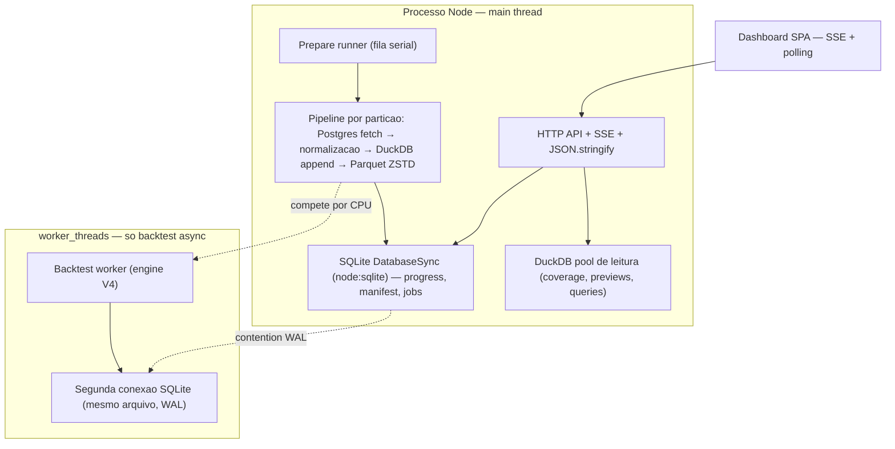

# Arquitetura V5 — Isolamento de Jobs e Responsividade da UI

> **Status: IMPLEMENTADO (jun/2026)**
> Data: 2026-06-12. Complementa a V4 (hot path colunar do motor) e a V3
> (consolidação de UX). Não conflita com nenhuma das duas — pode ser executada
> em paralelo.
>
> **Escopo**: este documento diagnostica por que o sistema inteiro (navegação
> entre telas, APIs, dashboard) fica lento enquanto um job de preparação de
> dados (reprocessar períodos / criar Parquet) ou um backtest está rodando —
> mesmo com CPU e RAM sobrando — e prescreve a correção em fases acionáveis
> (I0–I6), com arquivos-alvo, mudanças e critérios de aceite. Foi escrito para
> ser executado por outra ferramenta/agente sem precisar redescobrir os
> gargalos.

## 0. Por que este documento existe

Sintoma relatado em produção e em dev: ao criar um job que reprocessa períodos
de dados (gera/recria Parquet), o dashboard inteiro trava — mover entre telas
demora segundos, requisições simples (`/healthz`, listagens) ficam lentas. O
mesmo acontece, em menor grau, durante backtests. A máquina tem capacidade de
processamento e memória de sobra.

**A causa não é falta de recurso — é arquitetura de concorrência.** O pipeline
de preparação roda **no mesmo thread do servidor HTTP**, bloqueando o event
loop do Node; o DuckDB de escrita abre threads demais; o SQLite síncrono
serializa escritas; e o frontend amplifica a carga refazendo consultas pesadas
a cada evento de progresso.

A V4 ataca a velocidade do *motor de backtest* (throughput de ticks). A V5
ataca a **responsividade do processo** enquanto qualquer trabalho pesado roda.
São ortogonais: mesmo com o motor V4 instantâneo, um job de Parquet de 30 dias
continuaria congelando a UI sem as correções daqui.

**Meta de viabilidade (critério de aceite do plano inteiro):**

| Métrica | Hoje | Meta V5 |
|---|---|---|
| Latência de `GET /healthz` durante job de backfill | segundos (event loop bloqueado) | **p95 < 200 ms** |
| Troca de tela no dashboard durante job | trava perceptível (1–10 s) | **< 500 ms** |
| `GET /api/prepare/jobs` durante job longo | cresce com o nº de arquivos do job | **payload estável, < 50 ms** |
| `GET /api/data/coverage` pós-job | escaneia o histórico inteiro | **limitado ao intervalo pedido** |
| Backtest disparado pela API | pode rodar síncrono no main thread | **sempre via fila/worker** |

---

## 1. Diagnóstico: o trabalho pesado roda no thread errado

### 1.1 Topologia atual do processo

Tudo abaixo vive em **um único processo Node** (`src/server.js`):



O backtest **async** já roda em `worker_threads` (`src/backtest/queue.js` +
`src/backtest/worker.js`). Os **prepare jobs não**: rodam inline no main
thread, junto com o servidor HTTP.

### 1.2 Os 6 gargalos (verificados no código)

| # | Gargalo | Evidência | Sev. |
|---|---------|-----------|------|
| **G1** | Prepare jobs executam no main thread: `runNext()` faz `await executeActions(...)` no mesmo event loop que atende HTTP/SSE | `src/prepare/runner.js` l.79–123 (`runNext` → `executePreparationActions`); `src/server.js` cria tudo num processo | 🔴 |
| **G2** | Escrita Parquet bloqueia o event loop: append linha a linha com yield só a cada 25.000 linhas (`APPEND_YIELD_ROWS`), `flushSync()`/`closeSync()`, e `COPY ... PARQUET ZSTD` ocupando até `min(availableParallelism(), 16)` threads **por instância** — com `PREPARE_MAX_CONCURRENT=2` (default), 2 instâncias simultâneas | `src/sync/duckdbParquet.js` l.11, l.204–253 (`writeWithDuckDb`, `configureDuckDb`, `appendRowsCooperatively`); `src/config.js` (`prepareMaxConcurrent` default 2) | 🔴 |
| **G3** | SQLite síncrono no main thread: `node:sqlite` `DatabaseSync` com `busy_timeout = 5000`; progresso persistido a ~1 Hz + a cada arquivo concluído; `progress_json` **acumula** o array `files` inteiro (cresce sem limite durante o job) | `src/state/sqlite.js` l.196–201; `src/prepare/runner.js` l.56–76 (`createProgressReporter`, `nextFiles = [...progress.files, ...patch.files]`); `src/state/prepareJobs.js` l.33–40 | 🔴 |
| **G4** | Materialização do dia inteiro em RAM: a query Postgres traz todos os ticks+books da partição num único array antes de qualquer escrita (`book_depth=25` → dezenas de colunas por tick) | `src/source/postgres.js` l.164–199 (`getTicksWithBooksForEvents`, sem cursor/streaming) | 🟠 |
| **G5** | Frontend amplifica a carga: cada SSE `job:progress` dispara `GET /api/prepare/jobs` (que faz `JSON.parse` de `request_json` + `plan_json` + `result_json` + `progress_json` por job); job concluído dispara `GET /api/data/coverage`, que **expande o intervalo ao min/max do manifest inteiro** e parseia `quality_details_json` de cada partição | `public/js/views/data.js` l.1764–1784 (`bindJobsSse` → `refreshJobs` + `refreshCoverage`); `src/state/prepareJobs.js` l.80–95 (`toApiJob`); `src/query/coverageUi.js` l.59–76 (expansão `startDt`/`endDt` para `bounds.min_dt`/`max_dt`) | 🟠 |
| **G6** | Caminhos síncronos de backtest no main thread: `POST /api/backtest/run` sem `async:true` e `POST /api/backtest/sweep` executam `runBacktest`/`runBacktestSweep` inline, segurando a resposta HTTP e o event loop | `src/api/server.js` l.583–594 (branch sem async), l.663–665 (sweep) | 🟠 |

### 1.3 Por que "tem CPU sobrando" e mesmo assim trava

Node executa JavaScript em **um único thread**. Não importa quantos cores a
máquina tenha: enquanto o main thread está dentro de um loop de
`appendRow(rows[i])` (até 25 mil iterações entre yields), de um
`JSON.stringify` de progresso grande, ou esperando um `flushSync`, **nenhuma
requisição HTTP é atendida**. Os cores extras ficam ociosos (ou pior: são
tomados pelas threads internas do DuckDB, que competem com tudo). O sintoma
"lento com recursos sobrando" é a assinatura clássica de event loop bloqueado
— não de falta de capacidade.

Agravantes em cadeia:

1. G1+G2 bloqueiam o event loop → todas as rotas ficam lentas.
2. G3 serializa escritas no WAL → o backtest worker e a API disputam o mesmo
   arquivo SQLite (até 5 s de `busy_timeout`).
3. G5 faz a UI pedir exatamente as rotas mais caras (`/api/prepare/jobs`,
   `/api/data/coverage`) **no momento em que o servidor está mais ocupado** —
   cada evento de progresso vira uma rajada de queries.

---

## 2. O princípio da correção

> **O main thread do servidor só faz I/O leve: rotear HTTP, emitir SSE, ler/
> escrever linhas pequenas no SQLite. Todo trabalho pesado — export Parquet,
> normalização, backtest — roda em worker ou processo separado. O frontend
> consome o que o SSE entrega; nunca refaz consultas pesadas por evento de
> progresso.**

Três pilares, em ordem de impacto:

```
P1  Isolar o pipeline de preparação (worker_thread) — resolve G1, G2 parcial
P2  Dieta de dados: progress enxuto, jobs slim, coverage limitada — resolve G3, G5
P3  Fechar caminhos síncronos restantes (sweep/run inline, streaming PG) — resolve G4, G6
```

Cada fase entrega valor sozinha e tem rollback trivial (flag de env ou
revert localizado).

---

## 3. Fases de execução (I0–I6)

### I0 — Mitigação imediata por configuração (sem código)

Aplicável **hoje**, em produção (Coolify) e dev, enquanto as fases seguintes
não são implementadas:

| Env | Valor recomendado | Efeito |
|-----|-------------------|--------|
| `SYNC_DUCKDB_THREADS` | `2` (container) / `4` (máquina dedicada) | limita as threads de cada instância DuckDB de escrita (hoje o default é `min(cores,16)` — em `src/sync/duckdbParquet.js` l.236–237) |
| `PREPARE_MAX_CONCURRENT` | `1` | uma partição por vez no export; reduz pico de CPU/RAM e a fatia do event loop tomada pelo append (`src/config.js`) |
| `SYNC_DUCKDB_MEMORY_LIMIT` | ex.: `2GB` | teto de memória por instância de escrita |
| `DUCKDB_THREADS` | `2`–`4` | pool de leitura (`src/query/duckdbPool.js`, default 4) |

Regra de orçamento (mesma lição da V2/V4, `BACKTEST_WORKERS`):
`SYNC_DUCKDB_THREADS × PREPARE_MAX_CONCURRENT + DUCKDB_THREADS +
BACKTEST_WORKERS × MAX_CONCURRENT_BACKTESTS ≤ vCPUs disponíveis`.

Também por procedimento: fatiar backfills longos por semana (já recomendado em
`docs/operacao/deploy-coolify.md`) e nunca chamar `/api/backtest/run` sem
`async: true` (a UI do Estúdio já usa async; o risco é uso direto da API).

- **Arquivos**: nenhum (envs no Coolify / `.env` local). Atualizar a tabela de
  envs em `docs/operacao/deploy-coolify.md` no mesmo PR da I1.
- **Critério de aceite**: durante um backfill de 7 dias com `book_depth=25`,
  `GET /healthz` mantém p95 < 1 s (ainda não é a meta final — é mitigação).

### I1 — Prepare jobs em `worker_thread` (resolve G1)

Mover a execução de `executePreparationActions` para um worker dedicado,
seguindo **o mesmo padrão já existente** em `src/backtest/queue.js` +
`src/backtest/worker.js` (que já provou o modelo: worker abre a própria
conexão SQLite via `openStateDatabase(workerData.stateDbPath)` e reporta
progresso por `parentPort.postMessage`).

Mudanças:

1. Criar `src/prepare/worker.js`: recebe `{ stateDbPath, jobId, configSnapshot }`
   via `workerData`; abre conexão SQLite própria; cria o pool Postgres próprio
   (`src/source/postgres.js`); executa `executePreparationActions`; envia
   mensagens `{ type: 'progress' | 'completed' | 'failed' | 'cancelled', ... }`
   pelo `parentPort`.
2. Refatorar `src/prepare/runner.js`: `runNext()` deixa de fazer `await
   executeActions(...)` inline e passa a instanciar o `Worker`, repassando as
   mensagens de progresso para `updatePrepareJobProgress` + `onEvent` (SSE) no
   main thread. Cancelamento (`cancel()`) vira `worker.postMessage({ type:
   'cancel' })` — o executor já checa `shouldCancel()` cooperativamente, basta
   conectar o sinal.
3. Manter a fila serial (1 job `running` por vez) — o objetivo é isolamento,
   não paralelismo de jobs.
4. Flag de rollback: `PREPARE_RUNNER=inline` mantém o caminho atual por um
   ciclo de release (default passa a `worker`).

Atenção a dois detalhes do código atual:

- O progress reporter (`createProgressReporter`, `src/prepare/runner.js`
  l.43–77) hoje vive no runner; com o worker, a montagem do objeto de
  progresso vai junto para o worker e o main thread só persiste/emite o que
  recebe — não recalcular nada no main thread.
- O pool Postgres do main thread (usado por previews de qualidade) **não**
  deve ser compartilhado com o worker; cada lado cria o seu respeitando
  `SYNC_MAX_POOL`.

- **Arquivos**: `src/prepare/runner.js`, novo `src/prepare/worker.js`,
  `src/config.js` (flag), testes em `tests/` que cobrem o runner.
- **Critério de aceite**: durante job de backfill de 30 dias `backtest_ticks`
  `book_depth=25`, `GET /healthz` responde p95 < 200 ms e a navegação entre
  telas não trava; job cancelável; `npm test` verde nos dois modos da flag.
- **Risco**: médio (refactor do ciclo de vida do job). É a fase de maior
  impacto — **fazer primeiro**.

### I2 — Dieta do progresso e da listagem de jobs (resolve G3, metade de G5)

1. **Parar de acumular `files` em `progress_json`**: em
   `src/prepare/runner.js` (ou no worker pós-I1), manter no objeto de
   progresso apenas contadores (`files_count`, `bytes_total`) e os **últimos
   N (ex.: 5) arquivos** para exibição. A lista completa de arquivos já vai
   para `result_json` ao completar (`markPrepareJobCompleted`) — não precisa
   viver no progresso. Isso estabiliza o custo do `UPDATE` por segundo e do
   `JSON.parse` em cada `GET`.
2. **Listagem slim**: `listPrepareJobs` (`src/state/prepareJobs.js` l.14–17)
   passa a aceitar `{ slim: true }` e a **não** retornar `plan` e `result`
   (campos grandes) — apenas id, status, mode, percent/progresso resumido e
   timestamps. `GET /api/prepare/jobs` usa slim por default; `GET
   /api/prepare/jobs/:id` continua completo (a UI de detalhe usa esse).
3. Selecionar colunas explícitas no SQL do slim (evitar `SELECT *` +
   `JSON.parse` de blobs que serão descartados).

- **Arquivos**: `src/state/prepareJobs.js`, `src/prepare/runner.js` (ou
  `worker.js`), `src/api/server.js` (rota), `public/js/views/data.js` (ler o
  shape slim), `docs/referencia/contratos-api-schemas.md` (contrato — mesmo PR).
- **Critério de aceite**: `GET /api/prepare/jobs?limit=10` responde < 50 ms e
  com payload < 20 KB mesmo com um job de 90 dias em andamento.
- **Risco**: baixo. Cuidado com consumidores do shape antigo (UI de Dados e
  qualquer script que leia `progress.files`).

### I3 — Frontend orientado a SSE, sem refetch por evento (resolve a outra metade de G5)

Hoje `bindJobsSse` (`public/js/views/data.js` l.1764–1784) chama
`refreshJobs(ctx)` em **todo** `job:progress` — e o payload SSE **já contém o
objeto de progresso** (`{ type: 'job:progress', jobId, status, progress }`,
emitido em `src/prepare/runner.js` l.75).

1. Em `job:progress`: atualizar o card do job **diretamente com o payload do
   evento** (percent, fase, contadores) — zero chamadas HTTP.
2. `refreshJobs` só em `job:completed`/`job:failed` (e na entrada da tela),
   com debounce de ≥ 2 s para rajadas.
3. `refreshCoverage` só em `job:completed` com sucesso — **uma** vez, não em
   cada evento — e (após I4) limitada ao intervalo do job.
4. Manter o `setInterval` de 500 ms apenas como animação de DOM (já é assim —
   `tickJobsProgress` não consulta servidor; não mexer).

- **Arquivos**: `public/js/views/data.js` (e `public/js/utils/sse.js` se o
  payload precisar ser repassado integral). Incrementar `?v=` dos assets em
  `public/index.html` (cache Cloudflare — regra do workspace).
- **Critério de aceite**: durante job ativo, a aba Network do navegador mostra
  zero requisições a `/api/prepare/jobs` entre eventos de progresso; a barra
  de progresso continua fluida.
- **Risco**: baixo.

### I4 — Coverage sob controle (resolve o resto de G5)

`getDataCoverage` (`src/query/coverageUi.js` l.59–76) expande o intervalo
pedido para `[min(dt), max(dt)]` do manifest inteiro — um formulário de 7 dias
vira um scan de centenas de partições, cada uma com `JSON.parse` de
`quality_details_json` (em `src/query/availability.js`).

1. **Não expandir por default**: responder apenas o intervalo pedido. Para o
   heatmap "histórico completo", criar parâmetro explícito (`?full=1`) ou
   endpoint separado, chamado apenas quando o usuário abre essa visão.
2. **Endpoint de resumo barato** para o heatmap amplo: agregação SQL por mês/
   semana (`COUNT(*) GROUP BY status`), sem parsear `quality_details_json` —
   detalhes por dia só quando o usuário clica no período.
3. Avaliar cache TTL curto (30 s, mesmo padrão dos stats da V3) para a
   resposta full, invalidado em `job:completed`.

- **Arquivos**: `src/query/coverageUi.js`, `src/query/availability.js`
  (caminho sem details), `src/api/server.js`, `public/js/views/data.js`,
  `docs/referencia/contratos-api-schemas.md`.
- **Critério de aceite**: `GET /api/data/coverage` para 7 dias responde < 100 ms
  com 1 ano de manifest; a visão de histórico completo carrega via resumo
  agregado.
- **Risco**: médio (UX do heatmap precisa continuar equivalente — alinhar com
  a V3 antes de mudar o contrato).

### I5 — Streaming Postgres → Parquet (resolve G4) — opcional, maior refactor

Hoje `getTicksWithBooksForEvents` (`src/source/postgres.js` l.164–199)
materializa o dia inteiro num array. Com `book_depth=25`, dias densos custam
centenas de MB de heap por partição (×2 com concorrência 2) — pressão de GC
que também degrada o restante do processo (pós-I1, degrada o worker, o que é
aceitável; por isso esta fase é opcional e vem depois).

1. Trocar a query única por **batches** (cursor `pg` ou paginação por
   `(ts, id)` com `LIMIT`), aproveitando o `SYNC_BATCH_SIZE=50000` já
   reservado em `docs/operacao/deploy-coolify.md`.
2. Alimentar o appender DuckDB batch a batch (o appender já existe; só muda a
   origem dos rows), mantendo `shouldCancel` entre batches.
3. Pico de RAM por partição passa a ser O(batch), não O(dia).

- **Arquivos**: `src/source/postgres.js`, `src/sync/duckdbParquet.js`,
  `src/prepare/executor.js` (orquestração), `src/sync/normalizePartition.js`
  (normalização por batch).
- **Critério de aceite**: backfill de 1 dia denso `book_depth=25` com pico de
  heap < 1 GB (medir com `--max-old-space-size` reduzido em teste); paridade
  binária do Parquet gerado (mesmas linhas/contagens do caminho atual).
- **Risco**: médio-alto (normalização pode depender de visão do dia inteiro —
  verificar `applyTickNormalization` antes; se depender, normalizar por evento,
  que é a unidade natural).

### I6 — Eliminar caminhos síncronos de backtest (resolve G6)

1. `POST /api/backtest/run`: remover o branch síncrono (`src/api/server.js`
   l.593 em diante) — `async: true` vira o único comportamento (a rota responde
   202 + run id sempre). Período de transição: aceitar `async: false` mas
   internamente enfileirar e **aguardar** o worker (a API mantém o contrato de
   resposta completa sem bloquear o event loop).
2. `POST /api/backtest/sweep` (l.663–665): mover `runBacktestSweep` para a
   mesma fila/worker de backtest (a V4-F5 já planeja sweep nativo no worker —
   coordenar para não duplicar; se a V4-F5 estiver próxima, esta sub-tarefa é
   dela).

- **Arquivos**: `src/api/server.js`, `src/backtest/queue.js`,
  `docs/referencia/contratos-api-schemas.md`.
- **Critério de aceite**: nenhuma rota da API executa `runBacktest`/
  `runBacktestSweep` no main thread (verificável por grep); sweep de 50
  variantes não degrada `GET /healthz`.
- **Risco**: baixo (UI já usa async; só consumidores diretos da API mudam).

### Tabela-resumo

| Fase | Entrega | Resolve | Depende de | Risco | Impacto na UX |
|------|---------|---------|-----------|-------|----------------|
| **I0** | Envs de contenção (threads/concorrência) | G2 parcial | — | nulo | médio (imediato) |
| **I1** | Prepare jobs em worker_thread | G1, G2 | — | médio | **alto — é a correção principal** |
| **I2** | Progress enxuto + jobs slim | G3, G5 parcial | — | baixo | médio |
| **I3** | Frontend consome SSE, sem refetch por evento | G5 | I2 (shape) | baixo | médio |
| **I4** | Coverage limitada + resumo agregado | G5 | — | médio | médio |
| **I5** | Streaming Postgres → Parquet | G4 | I1 | médio-alto | baixo (pós-I1) |
| **I6** | Backtest sempre via fila/worker | G6 | — | baixo | médio |

Ordem recomendada: **I0 (hoje) → I1 → I2 → I3 → I6 → I4 → I5**.
I0 é operacional e imediata; I1 elimina a causa raiz; I2+I3 cortam a
amplificação; I6 fecha a última porta de bloqueio; I4 e I5 são refinamento.

### Regras de merge por fase

1. Medição antes/depois com `scripts/profile-api-routes.js` (latência das
   rotas durante job ativo) anexada ao PR.
2. Flag ou caminho de rollback documentado (`PREPARE_RUNNER`, envs I0).
3. Suíte completa verde (`npm test`).
4. Contratos alterados refletidos em `docs/referencia/contratos-api-schemas.md`
   no mesmo PR (convenção do projeto).
5. Mudança de asset do frontend → bump de `?v=` em `public/index.html`.

---

## 4. O que NÃO muda

- **Lake Parquet** — formato, paths (`lake/`), manifest e validação intactos.
  A V5 muda *onde* o export roda, não *o que* ele produz.
- **Fila serial de prepare jobs** — continua 1 job por vez; isolamento ≠
  paralelismo.
- **Motor de backtest** — engine, GLS, ColumnSet são território da V4.
- **SSE como canal de progresso** — contratos `job:*` e `run:*` mantidos
  (I2 só enxuga o payload de `progress`).
- **SQLite como state store** — mesmo schema; workers já abrem conexões
  próprias via WAL (padrão provado pelo backtest worker).

## 5. Riscos e mitigações

| Risco | Mitigação |
|-------|-----------|
| Worker de prepare divergir do inline (config, env, paths relativos) | Snapshot de config serializável via `workerData`; flag `PREPARE_RUNNER=inline` como rollback; testes do runner rodando nos dois modos |
| Contention WAL aumentar com mais uma conexão de escrita | I2 reduz a frequência e o tamanho dos writes de progresso; `busy_timeout` já cobre picos; monitorar `SQLITE_BUSY` em log |
| Quebrar consumidores do shape de `/api/prepare/jobs` | Slim por parâmetro com default novo documentado; `GET /:id` permanece completo; atualizar `contratos-api-schemas.md` |
| Heatmap de cobertura perder informação (I4) | Resumo agregado + drill-down sob demanda; alinhar com a V3 antes de mudar a UI |
| Normalização exigir o dia inteiro (I5) | Verificar `applyTickNormalization` antes de iniciar; fallback: normalizar por evento |
| Regressão de threads em container (lição V2: `availableParallelism()` do host) | I0 fixa envs explícitas; nunca derivar default de `availableParallelism()` em código novo |

## 6. Relação com os demais documentos

- **[arquitetura-v4-hot-path-colunar.md](arquitetura-v4-hot-path-colunar.md)** —
  performance do *motor* (throughput de ticks). A V5 cuida da
  *responsividade do processo*. A regra de orçamento de CPU (V4 §5.2) é
  estendida aqui (I0) para incluir as threads do sync. I6/sweep coordena com
  V4-F5.
- **[arquitetura-v3-consolidacao-ux.md](arquitetura-v3-consolidacao-ux.md)** —
  dona da UX da view Dados; I3/I4 mudam o comportamento de refresh e o
  contrato de coverage — alinhar antes de alterar o heatmap.
- **[arquitetura-v2-performance-ux.md](arquitetura-v2-performance-ux.md)** —
  origem do princípio "nunca bloquear o event loop nem o usuário" e da fila +
  SSE de backtest que a I1 replica para prepare jobs.
- **[../operacao/deploy-coolify.md](../operacao/deploy-coolify.md)** — recebe
  as envs da I0 e a regra de orçamento de CPU atualizada.
- **[../referencia/contratos-api-schemas.md](../referencia/contratos-api-schemas.md)** —
  atualizar em I2 (jobs slim), I4 (coverage) e I6 (backtest sempre async).
