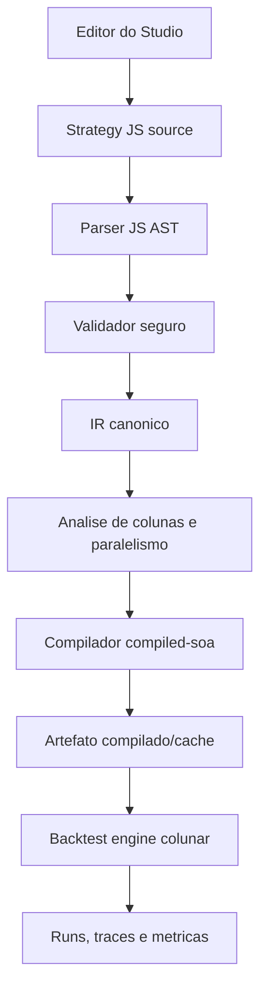

# Arquitetura V6 — Strategy JS No Editor

> Status: proposta para desacoplar totalmente estrategias do deploy.
> Data: 2026-06-19.
> Escopo: substituir GLS como linguagem de autoria principal por uma sintaxe
> JavaScript restrita, segura e compilada para o mesmo hot path colunar.

## 1. Objetivo

O objetivo desta evolucao e permitir que toda a logica de uma estrategia seja
criada, alterada, versionada, testada e executada no editor do Backtest Studio,
sem alterar arquivos do repositorio e sem fazer deploy da aplicacao.

O ponto central nao e trocar uma extensao `.gls` por `.js`. O ponto central e
separar claramente:

```text
codigo da estrategia
  editavel no Studio, salvo no SQLite, versionado por estrategia

runtime do produto
  estavel, seguro, testado, deployado raramente

primitivas de mercado/execucao
  biblioteca padrao pequena, versionada e compativel com o compilador colunar
```

Hoje o Studio ja permite editar GLS e executar estrategias salvas, mas ainda
existem pontos onde novas estrategias ou novas familias de modelos exigem mexer
no codigo da aplicacao. Esta V6 remove esses acoplamentos.

## 2. Decisao Recomendada

Adotar uma linguagem de autoria chamada aqui de **Strategy JS**:

```text
Strategy JS = subconjunto seguro de JavaScript, escrito no editor,
parseado por AST, validado, rebaixado para IR/bytecode e compilado para o
runtime colunar.
```

Esta decisao atende melhor ao fluxo com IA do que a GLS atual:

- modelos de IA ja geram JavaScript com mais consistencia do que uma DSL
  proprietaria;
- fica mais facil portar prototipos, pseudo-codigo e estrategias de pesquisa
  para o editor;
- o codigo fica mais familiar para humanos;
- ferramentas de editor, formatação, destaque e autocomplete sao melhores;
- snippets e exemplos podem parecer codigo JS normal.

Mas a decisao tem uma restricao obrigatoria:

```text
Nao executar JavaScript livre do Node.js como estrategia.
```

JavaScript livre resolveria a ergonomia, mas quebraria seguranca,
determinismo, reprodutibilidade e previsibilidade de performance. O caminho
correto e usar sintaxe JavaScript com semantica controlada.

## 3. Estado Atual

### 3.1 O que ja esta bem desacoplado

O sistema atual ja tem bases boas:

- `strategy_definitions` e `strategy_versions` no SQLite;
- editor no frontend com validacao e criacao de versoes;
- API de backtest exigindo `strategy_id` e `strategy_version_id`;
- snapshot imutavel da estrategia salvo no run;
- parser, validador, runtime, compilador e `compiled-soa`;
- hot path colunar com `ColumnSet`;
- `fastRun`, sweeps e paralelismo por evento quando seguro;
- traces, eventos e chart sidecar fora do hot path principal.

### 3.2 Onde ainda ha acoplamento

Ainda existem quatro acoplamentos que impedem a meta final.

#### A. Estrategias promovidas ainda nascem em arquivos

O servidor chama `seedPromotedStrategies(db)` no boot. Essa rotina descobre
estrategias em `labs/strategies`, le fontes GLS de arquivos, aplica presets e
faz insert/update em `strategy_versions`.

Isso transforma arquivos do repositorio em fonte primaria de algumas
estrategias. Para uma estrategia nova aparecer como campea no Studio, o fluxo
atual ainda tende a passar por commit/deploy.

#### B. Blocos/modelos exigem deploy

A biblioteca padrao fica em `src/backtestStudio/gls/standardLibrary.js` e a
whitelist do validador em `src/backtestStudio/gls/blocks.js`.

Quando uma estrategia precisa de um novo modelo, o fluxo atual recomenda:

```text
editar standardLibrary.js
editar blocks.js
rodar testes
deployar aplicacao
```

Isso e aceitavel para primitivas genericas, mas nao para logica especifica de
estrategia.

#### C. Alguns modelos pesados estao escondidos em `model.*`

Estrategias como Edge Sniper V3 e Impulse Elasticity ja sao GLS, mas parte
importante da decisao vive em funcoes como:

```text
model.directionProbability(...)
model.scoreSides(...)
model.scoreImpulseElasticitySides(...)
```

Essas funcoes estao em JavaScript deployado. Na pratica, o editor controla
parametros e composicao, mas nao toda a inteligencia da estrategia.

#### D. Gamma Ladder e um caso especial nativo

`Gamma Ladder V1` e detectada pelo nome e roteada para um runner dedicado. O
arquivo GLS dela e basicamente um envelope de parametros.

Isso preserva performance, mas viola a meta de "toda a estrategia no editor".

## 4. Principios Da V6

1. **Fonte de verdade no banco**: em producao, estrategias executaveis vivem em
   `strategy_versions`, nao em arquivos do repositorio.
2. **Editor primeiro**: qualquer estrategia deve poder nascer no editor ou ser
   importada para ele.
3. **JavaScript de autoria, nao JavaScript livre**: a sintaxe e JS; o runtime e
   controlado.
4. **Compilacao antes do hot path**: codigo salvo deve ser validado e compilado
   antes da execucao. O loop por tick nao deve interpretar JS arbitrario.
5. **Sem regressao de performance**: `compiled-soa`, column pruning,
   `fastRun`, sweeps e paralelismo continuam sendo requisitos.
6. **Determinismo**: sem rede, filesystem, ambiente, timers, `Date.now`,
   `Math.random`, `eval`, `Function`, `import`, `require`, `async` ou Promise.
7. **Reprodutibilidade**: todo run aponta para checksum da fonte, versao da
   linguagem, versao da stdlib, versao do compilador e artefato compilado.
8. **Compatibilidade gradual**: GLS v1 continua funcionando enquanto Strategy
   JS e introduzido.

## 5. Modelo Alvo



Na primeira fase, Strategy JS pode ser rebaixado para o AST GLS existente para
reutilizar o runtime atual. Nas fases seguintes, GLS AST e Strategy JS devem
convergir para um IR comum.

## 6. Sintaxe Strategy JS Proposta

### 6.1 Template recomendado

```js
export default strategy({
  name: "PTB Momentum",

  params: {
    minDistanceAbs: 50,
    minEdge: 0.07,
    maxAsk: 0.58,
    stopBid: 0.18,
    takeProfitBid: 0.92,
    maxOrderValue: 15,
  },

  onEventStart({ state }) {
    state.entered = false;
    state.maxBid = 0;
  },

  onTick(ctx) {
    const { tick, event, state, params, position, runState } = ctx;

    const secondsLeft = time.secondsUntil(event.end, tick.ts);
    const distance = market.distanceFromPtb(tick.underlyingPrice, event.priceToBeat);
    const side = market.sideFromPrice(tick.underlyingPrice, event.priceToBeat);
    const probUp = prices.marketProbUp(tick);
    const ask = book.ask(side, tick);
    const bid = book.bid(side, tick);
    const edge = signals.directionalEdge(side, probUp, ask);

    if (!state.entered && secondsLeft <= 105 && secondsLeft >= 4) {
      if (distance >= params.minDistanceAbs && edge >= params.minEdge && ask <= params.maxAsk) {
        const bought = orders.enter(side, {
          price: ask,
          budget: Math.min(params.maxOrderValue, params.walletSize + runState.totalPnl),
          reason: "distance_edge_entry",
        });

        if (bought) {
          state.entered = true;
          trace.mark("entry", { side, ask, edge });
        }
      }
    }

    if (position.open) {
      if (bid > state.maxBid) state.maxBid = bid;

      if (bid <= params.stopBid) {
        orders.exit({ price: bid, reason: "stop_bid" });
      }

      if (bid >= params.takeProfitBid) {
        orders.exit({ price: bid, reason: "take_profit" });
      }
    }
  },

  onEventEnd() {
    orders.closeOpenPosition({ reason: "event_end" });
  },
});
```

### 6.2 Por que este formato e melhor para IA

Este formato e mais facil para IA porque:

- usa `export default strategy({...})`, padrao familiar;
- parametros sao objeto JS simples;
- hooks sao funcoes JS comuns;
- permite `const`, `return`, operadores e nomes idiomaticos;
- o modelo pode gerar uma estrategia inteira sem conhecer uma gramatica
  proprietaria;
- fica natural copiar trechos de pesquisa para o editor;
- erros de validacao podem apontar para conceitos conhecidos de JS.

### 6.3 O que parece JS, mas nao e permitido

O editor deve mostrar erros claros para:

```js
import fs from "node:fs";        // proibido
require("fs");                   // proibido
fetch("https://...");            // proibido
eval("...");                     // proibido
new Function("...");             // proibido
Date.now();                      // proibido
Math.random();                   // proibido
setTimeout(() => {}, 1000);      // proibido
async function onTick() {}       // proibido
while (true) {}                  // proibido
class Foo {}                     // proibido no v1
```

O objetivo e o codigo parecer JS, mas executar como estrategia deterministica.

### 6.4 `Math.*` permitido vs proibido

O template usa `Math.min(...)`, entao a linguagem precisa de uma decisao
explicita sobre `Math.*`. A regra:

```text
Permitido (puro e deterministico), com lowering para math.*:
  Math.abs, Math.min, Math.max, Math.sqrt, Math.floor, Math.ceil,
  Math.round, Math.trunc, Math.sign, Math.pow, Math.hypot, Math.log,
  Math.exp, Math.cbrt
  -> rebaixados para math.abs/min/max/... (stdlib atual)

Proibido (nao deterministico ou fora de escopo):
  Math.random   // nao deterministico
  qualquer outro membro de Math nao listado na whitelist
```

A stdlib atual ja expoe `math.*` (`abs`, `min`, `max`, `clamp`, `sqrt`,
`logistic`, `erf`, `normalCdf`). O validador deve aceitar `Math.<fn>` apenas
quando `fn` estiver na whitelist e fazer lowering para a primitiva `math.<fn>`
equivalente, criando o alias quando faltar. Isso mantem o template legivel para
IA sem abrir mao do determinismo.

## 7. Escopo Da Linguagem Strategy JS V1

### 7.1 Permitido

- `export default strategy({...})`;
- chamada direta `strategy({...})` como alternativa sem `export`;
- objeto `params` com defaults literais;
- hooks `onEventStart`, `onTick`, `onEventEnd`;
- `const` e `let`;
- `if/else`;
- `return`;
- operadores aritmeticos e booleanos;
- ternario `cond ? a : b`;
- objetos e arrays literais pequenos;
- acesso a `ctx`, destructuring controlado e bindings reconhecidos;
- chamadas a namespaces permitidos: `market`, `prices`, `book`, `signals`,
  `risk`, `time`, `math`, `orders`, `trace`;
- funcoes auxiliares puras no mesmo arquivo, desde que analisaveis e
  **inlinaveis em tempo de compilacao** (ver 8.1.1). Sem recursao, sem
  fechar sobre estado mutavel fora de seus argumentos;
- loops `for` com **limite literal estatico**, ou na forma
  `min(param, LIMITE_LITERAL)` onde `LIMITE_LITERAL` e validado em compile-time
  (caso de uso: varrer ate N niveis de book). O codegen deve gerar um `for`
  nativo com bound check, nunca um loop interpretado;
- objetos literais pequenos como argumento de `orders.*`/`trace.*`
  (ex.: `orders.enter(side, { price, budget, reason })`).

### 7.2 Proibido

- qualquer import real;
- qualquer API Node.js;
- rede;
- filesystem;
- ambiente;
- `eval`, `Function`, `with`, `this` global;
- `new` fora de objetos permitidos;
- `async`, `await`, Promise;
- generators;
- prototype mutation;
- monkey patching;
- loops sem limite estatico;
- recursao;
- variaveis globais mutaveis fora de `state` e `runState`;
- leitura de propriedades dinamicas que o analisador nao consegue mapear;
- **arrays literais e metodos de array dentro de `onTick`** (`[...]`,
  `.map`, `.filter`, `.reduce`, `.sort`, `.forEach`): qualquer alocacao por
  tick gera pressao de GC e regride `processMs`. Arrays literais so sao
  permitidos como constante de topo (fora dos hooks) ou em `params`;
- `Math.random` e qualquer membro de `Math.*` fora da whitelist da 6.4.

### 7.3 Objetos disponiveis no hook

```js
{
  tick,
  event,
  state,
  runState,
  position,
  params,
}
```

Namespaces globais permitidos:

```js
market.*
prices.*
book.*
signals.*
risk.*
time.*
math.*
orders.enter(...)
orders.exit(...)
orders.reverse(...)
orders.closeOpenPosition(...)
trace.log(...)
trace.mark(...)
trace.metric(...)
```

Aliases de compatibilidade podem existir:

```js
enter(...)
exit(...)
reverse(...)
closeOpenPosition(...)
mark(...)
log(...)
metric(...)
```

Mas a documentacao nova deve preferir `orders.*` e `trace.*`.

## 8. Arquitetura De Compilacao

### 8.1 Fase inicial: Strategy JS para GLS AST

Para reduzir risco, a primeira entrega deve converter Strategy JS para o AST
que o runtime atual ja entende.

```text
Strategy JS source
  -> JS AST
  -> validacao de seguranca
  -> lowering para AST GLS v1
  -> runtime/compiled-soa existente
```

Beneficio:

- nao muda o motor de backtest;
- nao muda o hot path;
- nao muda persistencia de runs;
- permite UI e autoria JS rapidamente;
- usa os testes de paridade atuais como oraculo.

Limite:

- no comeco, Strategy JS aceita apenas o que pode ser representado no AST
  atual ou em extensoes pequenas dele. O AST GLS atual nao tem funcoes de
  usuario, loops nem arrays; portanto, na Fase 1, Strategy JS so aceita o
  subconjunto que rebaixa diretamente para hooks + expressoes + whitelist.

### 8.1.1 Funcoes auxiliares: inlining antes da analise de colunas

O `compiled-soa` atual gera chamadas **estaticas** (`lib.market.distanceFromPtb(...)`)
e bindings estaticos de coluna (`__c_underlying_price[ctx.__i]`) justamente
porque GLS nao tem funcoes de usuario. Para preservar performance e column
pruning ao introduzir funcoes auxiliares, a regra e:

```text
funcao auxiliar pura -> inlining em tempo de compilacao (substituir a
chamada pelo corpo, com os argumentos ligados como locals).
```

Consequencias obrigatorias:

- o **inlining acontece antes** de `analyzeStrategyColumns`, para que os
  acessos a `tick.*`/`book.*` dentro do corpo da funcao sejam visiveis ao
  column pruning;
- o **destructuring de `ctx`** (`const { tick, event } = ctx`) deve ser
  resolvido estaticamente para os bindings reais, senao `tick.underlyingPrice`
  nao vira `__c_underlying_price[ctx.__i]` e o pruning quebra;
- `analyzeStrategyParallelism` tambem deve enxergar `runState` **dentro** das
  funcoes auxiliares (apos inlining), para nao marcar como `parallelSafe` algo
  que le/escreve `runState`.

### 8.1.2 Fallback de analise de colunas deve falhar, nao expandir

Hoje, quando a analise nao identifica as colunas, o sistema tende a carregar o
dataset completo (`backtest_ticks`) com `bookDepth = 25` — uma regressao de I/O
silenciosa.

Na V6, se a analise estatica nao conseguir mapear 100% dos acessos a colunas, a
validacao deve **falhar** com erro estruturado e `fix_hint`, em vez de cair em
"carrega tudo". Acesso dinamico (`tick[field]`) ja e proibido (14.3); qualquer
construcao que impeca o pruning preciso entra na mesma regra.

### 8.2 Fase seguinte: IR canonico

Depois, criar um IR independente da sintaxe.

```text
GLS v1 parser ----\
                   -> Strategy IR -> validators -> compilers
Strategy JS parser /
```

O IR deve representar:

- estrategia;
- parametros;
- hooks;
- funcoes auxiliares puras;
- statements;
- expressoes;
- chamadas permitidas;
- leitura de colunas;
- escrita em `state`/`runState`;
- calls de ordem e trace.

Com isso, GLS vira legado/sintaxe antiga, e Strategy JS vira sintaxe principal.

### 8.3 Compilacao persistente

Hoje `strategy_versions` ja tem coluna `compiled_json`, mas a compilacao real
acontece sob demanda.

Na V6, o save da versao deve produzir:

```json
{
  "language": "strategy-js-v1",
  "source_checksum": "...",
  "language_version": "strategy-js-v1",
  "stdlib_version": "stdlib-v3",
  "compiler_version": "compiler-soa-v2",
  "ir_checksum": "...",
  "column_analysis": {},
  "parallelism": {},
  "bytecode_or_codegen": {}
}
```

O run deve usar o artefato se todos os checksums baterem. Se nao baterem, deve
recompilar antes de executar.

> Importante: a funcao produzida por `new Function(...)` **nao e serializavel**.
> O que `compiled_json` deve guardar e o **codigo-fonte JS gerado** (string) e
> os metadados (`column_analysis`, `parallelism`), nao a closure. No save,
> persistir a string permite pular parse + validate + lowering + codegen e ir
> direto para `new Function(cachedSrc)`. Em runtime, cada worker mantem um
> cache em RAM da funcao compilada **por checksum-de-codigo** (nao por params).

> Ganho em sweep: hoje cada variante recompila via `new Function`. Quando os
> params forem separados do codigo (ver 9.3 / Fase 7), o codigo-fonte fica
> **identico** entre as N variantes e a funcao compilada e reaproveitada — 1
> compilacao para N variantes, em vez de N compilacoes.

## 9. Persistencia

### 9.1 `strategy_versions`

Manter:

```text
language
source_code
params_schema_json
compiled_json
validation_json
checksum
notes
```

Passar a usar `compiled_json` de verdade.

Adicionar em migracao futura, se necessario:

```text
dependencies_json
compiler_version
stdlib_version
ir_json
```

Se preferir evitar muitas colunas, esses campos podem ficar dentro de
`compiled_json` e `validation_json`.

### 9.2 Bibliotecas editaveis

Para permitir funcoes reutilizaveis sem deploy, criar no pos-MVP:

```sql
CREATE TABLE IF NOT EXISTS strategy_library_definitions (
  id INTEGER PRIMARY KEY AUTOINCREMENT,
  slug TEXT NOT NULL UNIQUE,
  name TEXT NOT NULL,
  description TEXT,
  status TEXT NOT NULL DEFAULT 'draft',
  created_at TEXT NOT NULL DEFAULT (strftime('%Y-%m-%dT%H:%M:%fZ', 'now')),
  updated_at TEXT NOT NULL DEFAULT (strftime('%Y-%m-%dT%H:%M:%fZ', 'now'))
);

CREATE TABLE IF NOT EXISTS strategy_library_versions (
  id INTEGER PRIMARY KEY AUTOINCREMENT,
  library_id INTEGER NOT NULL REFERENCES strategy_library_definitions(id),
  version INTEGER NOT NULL,
  language TEXT NOT NULL DEFAULT 'strategy-js-v1',
  source_code TEXT NOT NULL,
  validation_json TEXT NOT NULL DEFAULT '{}',
  compiled_json TEXT,
  checksum TEXT NOT NULL,
  created_at TEXT NOT NULL DEFAULT (strftime('%Y-%m-%dT%H:%M:%fZ', 'now')),
  UNIQUE(library_id, version)
);
```

Na primeira fase, evitar imports de bibliotecas para reduzir risco. Permitir
copiar helpers para a propria estrategia. Bibliotecas versionadas entram quando
o compilador e o validador ja estiverem maduros.

> Nota de performance — modelos numericos pesados: funcoes como
> `model.directionProbability`, `model.scoreSides` e
> `model.scoreImpulseElasticitySides` usam hoje `map/filter/sort`, arrays
> intermediarios e amostragem temporal, e rodam como **uma call nativa
> otimizada pelo V8**. Reescreve-las como Strategy JS conflitaria com o escopo
> da linguagem (7.2 proibe array methods no `onTick`) e tenderia a alocar por
> tick. A recomendacao e implementar esses modelos como **biblioteca nativa
> versionada** (JS deployado, generico e parametrizavel, com `slug` + versao
> nesta tabela), referenciada pela estrategia. Assim o objetivo "zero deploy
> para nova estrategia" e atendido pela composicao/parametrizacao, sem mover
> logica hot para um codegen generico. Ver tambem 13.3 e Fase 6.

### 9.3 Presets separados da logica

Hoje salvar parametros recria uma versao da fonte. Isso funciona, mas mistura
codigo e preset.

Modelo alvo:

```sql
CREATE TABLE IF NOT EXISTS strategy_presets (
  id INTEGER PRIMARY KEY AUTOINCREMENT,
  strategy_id INTEGER NOT NULL REFERENCES strategy_definitions(id),
  strategy_version_id INTEGER NOT NULL REFERENCES strategy_versions(id),
  name TEXT NOT NULL,
  params_json TEXT NOT NULL,
  tags_json TEXT NOT NULL DEFAULT '[]',
  created_at TEXT NOT NULL DEFAULT (strftime('%Y-%m-%dT%H:%M:%fZ', 'now'))
);
```

Beneficio:

- ajustes de parametro nao duplicam codigo;
- comparar logica vs comparar parametros fica claro;
- IA pode gerar preset ou codigo, separadamente.

## 10. Mudancas Na API

### 10.1 Validacao

Endpoint atual pode continuar:

```http
POST /api/strategies/validate
```

Payload:

```json
{
  "language": "strategy-js-v1",
  "source_code": "export default strategy({...})"
}
```

Resposta:

```json
{
  "validation": {
    "ok": true,
    "language": "strategy-js-v1",
    "params_schema": {},
    "column_analysis": {},
    "parallelism": {
      "parallelSafe": true,
      "usesRunState": false
    },
    "compile": {
      "ok": true,
      "mode": "compiled-soa"
    },
    "errors": [],
    "warnings": []
  }
}
```

### 10.2 Criacao de versao

Endpoint atual continua:

```http
POST /api/strategies/:id/versions
```

Payload:

```json
{
  "language": "strategy-js-v1",
  "source_code": "export default strategy({...})",
  "notes": "Port para Strategy JS"
}
```

O backend deve:

1. parsear;
2. validar;
3. extrair parametros;
4. gerar IR;
5. analisar colunas;
6. analisar paralelismo;
7. compilar ou gerar artefato;
8. salvar `validation_json`, `params_schema_json`, `compiled_json` e checksum.

### 10.3 Capacidades do runtime

Criar endpoint ou evoluir `/api/strategy-blocks`:

```http
GET /api/strategy-runtime/capabilities
```

Resposta:

```json
{
  "languages": ["gls-v1", "strategy-js-v1"],
  "default_language": "strategy-js-v1",
  "stdlib_version": "stdlib-v3",
  "compiler_version": "compiler-soa-v2",
  "blocks": [],
  "syntax": {
    "forbidden": ["import", "require", "eval", "async"],
    "allowedHooks": ["onEventStart", "onTick", "onEventEnd"]
  }
}
```

Isso permite que o editor e uma IA saibam exatamente o que podem gerar.

## 11. Mudancas Na UI

### 11.1 Editor

Adicionar:

- seletor de linguagem por estrategia/versao;
- template Strategy JS como padrao para novas estrategias;
- validacao em tempo real com erros de sintaxe JS restrita;
- painel "runtime" mostrando:
  - linguagem;
  - checksum;
  - stdlib version;
  - compiler version;
  - modo de execucao;
  - colunas usadas;
  - se pode rodar paralelo;
- botao "Converter GLS para Strategy JS" quando abrir versao GLS.

### 11.2 Ajuda para IA

Adicionar no editor um painel "Contrato para IA" com:

- template Strategy JS;
- lista de APIs permitidas;
- exemplos de entrada, saida, stop e take profit;
- anti-exemplos proibidos;
- instrucoes de performance;
- limite de linguagem.

Esse painel deve ser copiavel para um prompt.

### 11.3 Linter de portabilidade

O linter deve retornar mensagens como:

```text
Line 12: imports are not allowed in Strategy JS.
Line 28: Date.now() is not deterministic. Use tick.ts or time.secondsUntil().
Line 44: while loops are not allowed. Use forRange(...) with a fixed limit.
Line 51: dynamic property access on tick cannot be compiled to columns.
```

### 11.4 Parametros

No curto prazo, parametros continuam sendo defaults em `params`.

No alvo, a UI deve permitir:

- editar parametros sem alterar codigo;
- salvar preset;
- comparar presets;
- rodar sweep de ranges;
- promover preset campeao.

## 12. Migracao GLS Para Strategy JS

### 12.1 Compatibilidade

Manter `gls-v1` funcionando. Nao quebrar runs antigos.

Cada run antigo ja tem snapshot da fonte; a UI deve continuar exibindo e
executando versoes GLS.

### 12.2 Conversor automatico

Criar conversor:

```text
GLS AST -> Strategy JS source
```

Exemplo:

```js
// GLS
strategy "Distance Entry" {
  param budget = 10
  onEventStart(event) {
    state.entered = false
  }
}
```

vira:

```js
export default strategy({
  name: "Distance Entry",
  params: {
    budget: 10,
  },
  onEventStart({ state }) {
    state.entered = false;
  },
});
```

### 12.3 Ordem de migracao

1. Estratégias simples criadas no editor.
2. Volatility Spike Mean Reversion.
3. Impulse Elasticity.
4. Edge Sniper V2/V3.
5. Gamma Ladder, apenas depois de expor primitivas suficientes para remover o
   runner dedicado.

## 13. Remocao De Acoplamentos

### 13.1 Seeds no boot

Estado atual:

```text
server start -> seedPromotedStrategies(db) -> le arquivos labs -> atualiza SQLite
```

Estado alvo:

```text
server start -> nao altera estrategias do usuario

acao explicita:
  importar do lab
  revisar diff
  salvar como nova estrategia/versao/preset
```

Tarefas:

- remover seed automatico em producao;
- manter seed automatico apenas em `TEST_MODE` ou comando explicito;
- criar comando `lab:promote-to-studio`;
- criar endpoint/admin action de importacao;
- nunca sobrescrever versao editada pelo usuario sem confirmacao.

### 13.2 Loader por arquivo

Estado atual:

```text
loadStrategy(request)
  aceita glsAst
  aceita .gls por caminho
  aceita modulo JS por caminho
```

Estado alvo em producao:

```text
loadStrategy(request)
  aceita strategy_version_id ou glsAst/jsAst interno ja validado
```

Tarefas:

- manter path/module loader para testes, labs e golden tests;
- bloquear path/module loader em API HTTP de producao;
- adicionar flag explicita para dev/test se necessario;
- garantir que o Studio sempre execute fonte do banco.

### 13.3 Standard Library

Regra:

```text
stdlib deployada deve conter primitivas genericas, nao estrategia especifica.
```

Exemplos aceitaveis:

```text
market.distanceFromPtb
book.ask
book.bid
book.liquidityRatio
math.normalCdf
signals.volatility
orders.enter
orders.exit
```

Exemplos que devem sair da stdlib generica e virar **biblioteca nativa
versionada** (nao reescritos como Strategy JS):

```text
model.scoreSides
model.scoreImpulseElasticitySides
model.directionProbability especifica do Edge Sniper
```

Motivo: esses modelos sao hot path, usam array methods/amostragem e ja estao
otimizados pelo V8. Reimplementa-los em Strategy JS regrediria `processMs` e
arriscaria paridade numerica. O acoplamento de deploy e removido tornando-os
**genericos + parametrizaveis** e versionando-os (`strategy_library_*`), nao
movendo-os para o codegen. A estrategia continua compondo/parametrizando esses
modelos pelo editor.

### 13.4 Gamma Ladder

Enquanto nao houver primitives suficientes para multi-posicao, box e hedge, a
estrategia deve ser marcada explicitamente como:

```json
{
  "execution_kind": "native-extension",
  "editable_logic": false
}
```

Isso evita a falsa impressao de que a logica esta toda no editor.

Depois, migrar em etapas:

1. expor inventario multi-side como primitiva generica;
2. expor `orders.enterPair` ou equivalente;
3. expor hedge/box como composicao Strategy JS;
4. reimplementar Gamma Ladder em Strategy JS;
5. rodar paridade;
6. remover roteamento por nome.

## 14. Performance

Esta V6 nao pode reduzir performance. Para isso, as regras abaixo sao
obrigatorias.

### 14.1 Nunca executar JS livre no loop por tick

Proibido:

```text
vm.runInContext por tick
Function(source) por tick
interpreted JS AST por tick em producao
eval por qualquer motivo
```

Permitido:

```text
parse/validate no save
compile no save ou no inicio do run
executar funcao gerada pelo compilador controlado
```

### 14.2 Manter `compiled-soa`

O Strategy JS deve chegar ao mesmo caminho atual:

```text
ColumnSet -> processIndex(i) -> compiled-soa hook
```

Se uma feature de Strategy JS nao puder ser compilada para SoA, ela deve:

- falhar validacao; ou
- exigir modo debug/interpreter explicitamente; ou
- ser implementada no compilador antes de liberar em producao.

### 14.3 Column pruning

O analisador deve continuar extraindo colunas usadas:

```text
tick.underlyingPrice -> underlying_price
tick.priceToBeat     -> price_to_beat
book.ask("UP", tick) -> up ask levels ou best ask
```

Qualquer acesso dinamico que impeça column pruning deve ser proibido ou
reescrito.

Proibido no v1:

```js
const field = "underlyingPrice";
const x = tick[field];
```

### 14.4 Paralelismo

Manter regra atual:

```text
se usa runState de forma que eventos dependem uns dos outros,
fallback para 1 worker.
```

O validador deve sinalizar:

```json
{
  "parallelSafe": false,
  "reason": "uses runState"
}
```

### 14.5 Benchmarks obrigatorios

Para cada fase:

```text
npm test
npm run bench:backtest
npm run bench:v4
```

Adicionar benchmark especifico:

```text
strategy-js vs gls equivalente
  1d BTC 5m
  7d BTC 5m
  fastRun sweep com N variantes
```

Criterios:

```text
summary identico
event count identico
totalPnl: paridade BIT-EXACT para estrategias convertidas (mesma logica,
  Fase 1/4). Tolerancia definida so para reescritas (ex.: modelo versionado)
processMs <= baseline * 1.05
duckdbReadMs sem regressao
ticks/s sem regressao
alocacao/GC por run e pico de RAM sem regressao (relevante em sweeps com
  SharedArrayBuffer)
compileMs medido e cacheado (hoje nao existe instrumentacao; criar antes do
  baseline)
```

### 14.6 Metricas por run

Persistir em `summary.timings` ou `strategyMeta`:

```json
{
  "language": "strategy-js-v1",
  "compilerMode": "compiled-soa",
  "compileCacheHit": true,
  "compileMs": 4,
  "columnsUsed": ["underlying_price", "price_to_beat"],
  "bookDepthUsed": 25,
  "parallelSafe": true,
  "workerCount": 4
}
```

### 14.7 Blindagem do gerador de codigo (seguranca + performance)

O hot path usa `new Function(src)` onde `src` e **gerado** pelo compilador, nao
a fonte do usuario. Como Strategy JS e mais expressivo que GLS, o gerador ganha
mais superficie e precisa de regras estritas para nunca virar vetor de injecao:

```text
- nunca interpolar a fonte do usuario diretamente no codigo gerado;
- serializar todo literal (strings de reason, name, numeros) via JSON.stringify;
- validar identificadores contra /^[A-Za-z_$][\w$]*$/ antes de emiti-los;
- emitir somente calls da whitelist (market/prices/book/signals/risk/time/
  math/orders/trace) resolvidas estaticamente;
- 'use strict' no topo do corpo gerado (ja e o caso no compiled-soa).
```

Sem isso, um `reason` ou `name` malicioso poderia escapar para dentro do
`new Function`. Esta regra vale para GLS hoje e passa a ser obrigatoria para
Strategy JS.

### 14.8 Limites de recurso no validate/compile

`Acorn` parseando fonte arbitraria no endpoint publico exige limites contra DoS,
herdando o que o GLS ja faz (max. de statements/hooks):

```text
- tamanho maximo da fonte;
- profundidade maxima do AST;
- numero maximo de nos/statements (GLS: 500 statements, 10 hooks);
- timeout de parse/validate.
```

## 15. Fluxo Com IA

### 15.1 Fluxo alvo

```text
Usuario descreve ideia
  -> IA gera Strategy JS
  -> Studio valida
  -> IA corrige erros de validacao
  -> Studio roda smoke em janela curta
  -> IA analisa trace/no-entry
  -> IA ajusta codigo ou parametros
  -> Usuario salva versao
  -> Usuario roda backtest maior/sweep
```

### 15.2 Contrato de prompt para IA

O Studio deve oferecer um texto como:

```text
Voce deve gerar Strategy JS v1 para o Backtest Studio.
Use export default strategy({...}).
Nao use imports, require, fetch, eval, async, Date.now ou Math.random.
Use tick.ts e event.end para tempo.
Use orders.enter/exit/reverse e trace.mark/log/metric.
Use apenas as APIs listadas.
O codigo deve ser deterministico e compilavel para compiled-soa.
```

### 15.3 Validacao orientada para correcao automatica

Erros devem ser estruturados para IA:

```json
{
  "line": 42,
  "column": 15,
  "code": "FORBIDDEN_DYNAMIC_TICK_ACCESS",
  "message": "tick[field] cannot be compiled. Use tick.underlyingPrice or another fixed property.",
  "fix_hint": "Replace dynamic property access with a fixed tick property."
}
```

## 16. Plano De Implementacao

> Ordem recomendada (ajuste de performance): as fases abaixo estao numeradas
> por tema, mas a sequencia de execucao sugerida antecipa os ganhos de cache:
>
> ```text
> 0 -> 1 -> 2 -> 3 (compiled_json + cache) -> 7 (presets separados)
>   -> 4 -> 5 -> 6 (model.* nativo versionado) -> 8 -> 9
> ```
>
> Motivo: a Fase 3 (cache de compilacao) e a Fase 7 (separar params do codigo)
> juntas transformam o sweep de "N compilacoes" em "1 compilacao para N
> variantes", um ganho direto antes de mexer em `model.*`. A Fase 6 vem depois,
> ja com cache e presets prontos e com o benchmark gate calibrado.

### Fase 0 — Baseline e decisao final

Entregas:

- documentar decisao Strategy JS vs GLS;
- registrar exemplos oficiais;
- medir benchmarks atuais;
- escolher parser JS.

Recomendacao de parser:

```text
Acorn
```

Motivo:

- pequeno;
- maduro;
- gera AST ESTree;
- suficiente para validar subset;
- evita manter parser JS proprio.

Aceite:

- documento aprovado;
- baseline salvo em `reports/bench`;
- matriz de features v1 definida.

### Fase 1 — Parser e validador Strategy JS

Novos arquivos sugeridos:

```text
src/backtestStudio/strategyJs/parser.js
src/backtestStudio/strategyJs/validator.js
src/backtestStudio/strategyJs/lowerToGlsAst.js
src/backtestStudio/strategyJs/index.js
```

Entregas:

- aceitar `export default strategy({...})`;
- extrair `name`;
- extrair `params`;
- extrair hooks;
- validar proibidos;
- mapear chamadas conhecidas;
- gerar erros com linha/coluna;
- rebaixar subset inicial para AST GLS atual.

Aceite:

- strategy JS simples roda com o runtime atual;
- validacao rejeita imports/eval/async;
- testes de paridade Strategy JS vs GLS simples.

### Fase 2 — API e UI

Entregas:

- `/api/strategies/validate` aceita `language=strategy-js-v1`;
- `createStrategyVersion` salva linguagem e artefato de validacao;
- editor cria novas estrategias em Strategy JS por padrao;
- seletor de linguagem aparece em versoes;
- autocomplete usa capabilities do runtime;
- painel de ajuda Strategy JS.

Aceite:

- usuario cria estrategia JS do zero na UI;
- salva versao;
- roda backtest;
- run persiste snapshot correto.

### Fase 3 — Compilacao persistente

Entregas:

- preencher `compiled_json`;
- cachear por checksum;
- medir `compileMs`;
- invalidar por `compiler_version` e `stdlib_version`;
- bloquear run se compilacao falhar.

Aceite:

- primeira execucao compila;
- execucoes seguintes usam cache;
- performance igual ao GLS equivalente.

### Fase 4 — Conversor GLS para Strategy JS

Entregas:

- `glsToStrategyJs(ast)`;
- botao na UI;
- teste com estrategias seed;
- preservar parametros e hooks;
- gerar codigo formatado.

Aceite:

- Edge Sniper V2 GLS converte;
- versao convertida valida;
- paridade de resultado mantida nos testes existentes.

### Fase 5 — Remover seed automatico como fonte primaria

Entregas:

- desativar `seedPromotedStrategies(db)` no boot de producao;
- criar comando explicito de importacao/promocao;
- UI ou CLI mostra diff antes de importar;
- importacao cria nova versao, nao sobrescreve silenciosamente.

Aceite:

- restart do servidor nao altera estrategias existentes;
- labs ainda conseguem promover campeoes explicitamente;
- testes atualizados para usar seed explicito.

### Fase 6 — Tirar `model.*` especifico da stdlib generica (biblioteca nativa versionada)

> Reescopo (decisao de performance): **nao** reescrever `model.*` pesados como
> Strategy JS. Eles permanecem JS nativo (hot path otimizado pelo V8), mas
> saem da stdlib generica deployada e passam a viver como **biblioteca nativa
> versionada** (`strategy_library_*`), generica e parametrizavel.

Entregas:

- extrair `model.scoreSides`, `model.scoreImpulseElasticitySides` e a parte
  especifica de `model.directionProbability` para uma biblioteca nativa
  versionada (`slug` + versao), generica e parametrizavel;
- manter apenas primitives genericas na stdlib;
- adicionar suporte do compilador para **funcoes auxiliares puras inlinaveis**
  (orquestracao leve, nao modelos pesados — ver 8.1.1);
- garantir paridade numerica entre o modelo antigo e o versionado;
- testar VSMR, Impulse e Edge.

Aceite:

- nova familia de estrategia nao exige alterar `standardLibrary.js`;
- nova versao de modelo numerico nao exige deploy (entra como versao de
  biblioteca);
- IA consegue gerar a orquestracao completa no editor;
- benchmarks sem regressao (modelo nativo versionado mantem `processMs`).

### Fase 7 — Presets separados

Entregas:

- criar `strategy_presets`;
- UI de presets;
- backtest pode receber `preset_id` ou params override;
- sweep trabalha em cima de preset/base version.

Aceite:

- alterar parametro nao cria versao de codigo obrigatoriamente;
- comparador distingue versao de codigo e preset.

### Fase 8 — Gamma Ladder

Entregas:

- marcar runner atual como `native-extension`;
- desenhar primitives faltantes;
- portar logica gradualmente;
- rodar paridade;
- remover deteccao por nome.

Aceite:

- Gamma Ladder deixa de depender de runner dedicado ou fica explicitamente
  documentada como excecao.

### Fase 9 — Remocao gradual de GLS como linguagem principal

Entregas:

- Strategy JS vira default;
- GLS continua read-only/legacy;
- docs e manuais passam a ensinar Strategy JS;
- labs geram Strategy JS;
- testes GLS permanecem como compatibilidade.

Aceite:

- nenhuma estrategia nova precisa ser criada em GLS;
- todas as estrategias editaveis principais estao em Strategy JS.

## 17. Testes Necessarios

### Parser/Validator

- estrategia JS minima;
- `export default strategy`;
- `strategy` sem export;
- params numericos, booleanos e strings;
- hook ausente;
- import proibido;
- require proibido;
- async proibido;
- eval proibido;
- Date.now proibido;
- Math.random proibido;
- dynamic tick access proibido;
- chamada desconhecida;
- escrita proibida fora de `state`/`runState`;
- loop sem limite proibido.

### Lowering/IR

- Strategy JS simples gera AST equivalente ao GLS;
- chamadas `orders.enter` viram `enter`;
- chamadas `trace.mark` viram `mark`;
- destructuring de `ctx` e resolvido;
- ternario funciona;
- return antecipado funciona.

### Runtime

- Strategy JS interpreter/debug vs compiled-soa;
- Strategy JS vs GLS equivalente;
- fastRun vs fullRun;
- runState marca fallback de paralelismo;
- column analysis identifica colunas corretas.

### API

- validar Strategy JS;
- salvar versao Strategy JS;
- executar Strategy JS;
- listar versoes mistas GLS/JS;
- snapshot de run contem linguagem e checksum;
- erro de compilacao impede run.

### UI

- criar nova Strategy JS;
- converter GLS para Strategy JS;
- salvar versao;
- validar erro inline;
- rodar smoke;
- abrir run e trace.

### Performance

- `compiled-soa` igual ou melhor que GLS equivalente;
- sem regressao em `processMs`;
- cache de compilacao funciona;
- sweeps continuam reaproveitando `ColumnSet`.

## 18. Riscos E Mitigacoes

| Risco | Mitigacao |
|---|---|
| Usuario achar que e JavaScript completo | Nomear como Strategy JS e mostrar limites no editor |
| IA gerar APIs proibidas | Linter com erro estruturado e `fix_hint` |
| Regressao de performance | Lowering para IR/compiled-soa, benchmark gate e cache |
| Falha de seguranca com JS livre | Nunca executar fonte JS diretamente; parsear AST e compilar subset |
| Perda de paridade GLS | Rodar dual-run GLS vs Strategy JS por estrategia migrada |
| Crescimento excessivo da linguagem | Versionar `strategy-js-v1`, aceitar poucas features por vez |
| `standardLibrary.js` continuar crescendo | Regra: stdlib so primitives genericas; modelos especificos como biblioteca nativa versionada |
| Gamma Ladder ficar escondida | Marcar como native-extension ate portar de verdade |
| Injecao de codigo no `new Function` gerado | Serializar literais com JSON.stringify, validar identificadores, nunca interpolar fonte do usuario (14.7) |
| Alocacao/GC por tick com arrays e array methods | Proibir `[...]` e `map/filter/sort` no `onTick`; arrays so como constante de topo (7.2) |
| Column pruning impreciso por destructuring/funcoes | Inlining antes do pruning; falhar validacao se a analise nao for completa (8.1.1 / 8.1.2) |
| Regressao ao reescrever `model.*` em Strategy JS | Manter modelos pesados como biblioteca nativa versionada, nao codegen (9.2 / 13.3 / Fase 6) |
| Loop com bound dinamico degradar o hot path | Exigir limite literal estatico ou `min(param, LIMITE_LITERAL)`; gerar `for` nativo (7.1) |
| DoS no validate via fonte grande | Limites de tamanho/profundidade/nos e timeout no parse Acorn (14.8) |

## 19. Criterios De Aceite Da V6

A V6 so deve ser considerada concluida quando:

- uma estrategia nova completa pode ser criada no editor em Strategy JS;
- a estrategia roda sem nenhum arquivo novo no repositorio;
- a estrategia nao exige alterar `standardLibrary.js` para logica especifica;
- a versao salva contem checksum, validacao, params schema e artefato compilado;
- o run usa `compiled-soa` em producao;
- benchmarks nao mostram regressao;
- seed automatico nao sobrescreve versoes em producao;
- labs promovem estrategias por importacao explicita;
- GLS antigo continua executando;
- pelo menos Edge/Impulse/VSMR possuem versoes Strategy JS editaveis;
- Gamma Ladder esta portada ou declarada explicitamente como excecao nativa.

## 20. Resumo Executivo

Usar JavaScript como linguagem de autoria e uma boa decisao para o objetivo de
ter estrategias feitas por IA e portadas diretamente para o editor. A ressalva
fundamental e que deve ser **Strategy JS**, nao JavaScript livre.

O caminho mais seguro e incremental e:

```text
Strategy JS no editor
  -> AST validado
  -> IR/GLS AST existente no curto prazo
  -> compiled-soa atual
  -> mesmo motor colunar e mesma performance
```

Depois, a evolucao natural e criar um IR canonico e mover modelos especificos
de `standardLibrary.js` para funcoes Strategy JS versionadas no banco.

Assim, a aplicacao deixa de precisar de deploy para alterar estrategia, mas
continua segura, deterministica, reproduzivel e rapida.
