# Relatório de Análise Comparativa: Estratégias Não Implementadas na Polymarket

Este documento apresenta uma análise conceitual, de microestrutura e quantitativa aprofundada das 11 estratégias de trading ainda não implementadas localizadas no diretório `docs/estrategias/nao-implementadas/`. 

O objetivo é classificar a robustez de cada tese com base em simulações em dados históricos densos (splits: 60% Train / 20% Validation / 20% Holdout Cego) e definir quais devem ser priorizadas para produção de forma científica.

---

## 1. Classificação e Recomendação de Produção

As estratégias foram divididas em três camadas baseadas no Profit Factor (PF) líquido pós-taxas obtido no split de **Holdout Cego**, na consistência diária e no risco de ruína estatística (Drawdown):

### 🏆 Camada 1: Altíssima Prioridade (Aprovadas para Produção)
Apresentam edges robustos e consistentes, ótima expectativa por trade, excelente resiliência a taxas (*fee drag*) e **Profit Factor Líquido no Holdout Cego $\ge 2.0$**.
1. **BCED V1 (Boundary Coherence Entropy Deviation):** A melhor em termos de payoff assimétrico consistente. Opera a distorção e o pânico de market makers quando a entropia do livro se desregula ($\mathcal{H}_{book} \ge 0.02$). Atingiu Profit Factor global de **3.40** (Holdout: **INF**) com win rate global de **62.0%** (100% no holdout cego). Expectativa média excelente de **+$13.33** por trade.
2. **ERM V1 (Empirical Residual Manifold - variante `tail-deep-liquid`):** Algoritmo não-paramétrico cirúrgico que usa probabilidade empírica baseada em bins tridimensionais históricos. Frequência muito baixa (~1.8 trades/dia), mas precisão espetacular com Win Rate global de **87.9%** (Holdout: **100%** de 13 trades), Profit Factor global de **11.24** (Holdout: **INF**) e drawdown máximo de apenas **$28.08**.
3. **SBRI V1 (Strike Boundary Repricing Inelasticity):** Captura a inelasticidade e lentidão dos formadores de mercado em ajustar as cotações imediatamente após o spot cruzar o strike (PTB). Profit Factor global de **2.12** que subiu para **4.08** no Holdout Cego, com win rate de **71.4%** no holdout e drawdown global máximo de apenas **$59.72**.

### 📈 Camada 2: Monitoramento em Paper Trading (Módulos Complementares)
Modelos com edge real positivo pós-taxas, mas que possuem limitações de Profit Factor global ($< 2.0$) ou maior sensibilidade a regimes de mercado.
1. **SEBT V1 (Stochastic Escape Barrier Theory):** Estratégia sniper cirúrgica de baixa frequência (~1 trade/dia) para escape estocástico imediato da barreira. Excelente PF de **4.56** no holdout e win rate global de **75%**, mas com amostra reduzida (20 trades).
2. **TAT V1 (Transition Acceleration Threshold):** Máquina de momentum direcional de alta frequência baseada em derivada de velocidade e aceleração instantâneas no strike, com stop loss curto ($stopCrossDist = -3.0$ USD). Excelente geradora de PnL bruto, mas exige capital elástico para suportar drawdowns devido à frequência média-alta.
3. **SCHT V1 (Strike Crossing Hesitation Theory):** Demonstrou excelente desempenho no holdout cego (PF **2.05**, WR **70.8%**), mas a validação negativa indica dependência estrita de regimes direcionais.

### 🛑 Camada 3: Rejeitadas (Não Recomendadas)
Apresentam micro-edges muito estreitos, riscos de regime ou sofrem com fee drags devastadores.
* **BGET V1:** Consumida quase integralmente por taxas da Polymarket (fee drag de **70.2%**).
* **KPLT V1:** Lucrativa, mas com PF no holdout cego modesto (**1.58**) e drawdown de treino excessivo (**$213.97**).
* **PMA V1 & IRI V1:** Extremamente expostas a ralis direcionais do BTC e com Profit Factors muito colados a 1.0.

---

## 2. Tabela Geral de Comparação Quantitativa

Todos os testes de laboratório foram executados sobre o banco local a partir de **2026-05-04 15:00Z** a **2026-05-22/23Z** (faixa média de 18 dias, ~3 milhões de ticks e ~5.100 eventos). 

*Configuração padrão: Banca Inicial de **$100.00** | Ordem Máxima de **$15.00** por evento. Taxas taker de 7% e slippages reais deduzidos.*

| Estratégia | Variante Campeã | Frequência (~trades/dia) | Win Rate (Geral / Holdout) | PnL Líquido Global | PnL Líquido Holdout | Profit Factor (Geral / Holdout) | Max Drawdown | Fee Drag | Status Recomendado |
| :--- | :--- | :---: | :---: | :---: | :---: | :---: | :---: | :---: | :--- |
| **BCED V1** | `bced-dist25` | 4-5 | 62.0% / 100% | **+$1,053.39** | **+$467.08** | **3.40 / INF** | $70.42 | **4.3%** | **🏆 Camada 1 (Prioridade)** |
| **ERM V1** | `tail-deep-liquid`| 1-2 | 87.9% / 100% | **+$578.01** | **+$293.24** | **11.24 / INF**| $28.08 | **3.0%** | **🏆 Camada 1 (Prioridade)** |
| **SBRI V1** | `sbri-cross10` | 4-5 | 58.8% / 71.4% | **+$574.54** | **+$183.89** | **2.12 / 4.08** | $59.72 | **7.9%** | **🏆 Camada 1 (Prioridade)** |
| **TAT V1** | `tat-maker-opt` | 29-30 | 41.4% / 46.2% | **+$1,098.57** | **+$259.65** | 1.47 / 1.59 | $104.49 | 3.4% | 📈 Camada 2 (Monitoramento) |
| **USVM V1** | `usvm-pechincha-v3` | 31-32 | 46.0% / 41.2% | **+$1,004.06** | **+$76.31** | 1.36 / 1.15 | $133.47 | 27.6% | 📈 Camada 2 (Monitoramento) |
| **SCHT V1** | `sch-impulsive-base`| 7-8 | 57.6% / 70.8% | **+$137.47** | **+$109.32** | 1.16 / 2.05 | $154.83 | 6.6% | 📈 Camada 2 (Monitoramento) |
| **SEBT V1** | `sebt-sec0.20` | 1 | 75.0% / 83.3% | **+$127.18** | **+$53.41** | 2.72 / 4.56 | $30.19 | 7.1% | 📈 Camada 2 (Monitoramento) |
| **KPLT V1** | `kplt-best-kli` | 27 | 64.5% / 70.0% | **+$453.94** | **+$122.54** | 1.26 / 1.58 | $213.97 | 30.4% | 🛑 Camada 3 (Rejeitada) |
| **IRI V1** | `iri-robust` | 22-23 | 64.6% / 67.1% | **+$287.58** | **+$75.82** | 1.13 / 1.22 | $134.62 | 6.7% | 🛑 Camada 3 (Rejeitada) |
| **PMA V1** | `pma-monotone-only` | 39 | 78.0% / 79.2% | **+$58.73** | **+$26.74** | 1.03 / 1.08 | $220.15 | ~50.0% | 🛑 Camada 3 (Rejeitada) |
| **BGET V1** | `bget-sec0.12` | 52 | 39.7% / 42.4% | **+$245.19** | **+$125.86** | 1.03 / 1.09 | $534.71 | **70.2%** | 🛑 Camada 3 (Rejeitada) |

---

## 3. Funcionamento, Vantagens e Desvantagens por Modelo

### 1. BCED V1 (Boundary Coherence Entropy Deviation)
*   **Conceito:** Monitora a descoordenação do livro de ordens através da entropia de incoerência ($\mathcal{H}_{book} = | (Ask_{UP} + Ask_{DOWN}) - 1.0 | \ge 0.02$). Quando a probabilidade física baseada em volatilidade de cauda rápida avança mais rápido que o preço do favorito cotado taker, compra o favorito com desconto expressivo na janela intermediária ($120\text{s} \ge \tau \ge 45\text{s}$). Adota Hold to Settlement.
*   **Vantagens:**
    *   **Altíssima robustez no Holdout Cego:** 100% de win rate nas 10 oportunidades detectadas no holdout.
    *   **Mínimo fee drag (4.3%):** Hold to Settlement elimina a taxa de saída, e as ordens baratas de entrada amortecem o custo taker absoluto.
    *   **Expectativa/Trade explosiva (+$13.33):** Altíssimo retorno sobre o capital exposto.
*   **Desvantagens:**
    *   Frequência moderada a baixa (~4 trades/dia).
    *   Exige pânico explícito no livro de ordens, passando dias em calmaria sem operar.

### 2. ERM V1 (Empirical Residual Manifold)
*   **Conceito:** Aborda o mercado de forma puramente não-paramétrica. Constrói uma manifold tridimensional empírica calibrada condicional a tempo restante ($\tau$), distância assinada ao PTB, volatilidade e cruzamentos passados. Opera quando a probabilidade empírica real de settlement ($p_{emp} \ge 0.80$) exibe um desalinhamento massivo (edge $\ge 0.28$, residual $\ge 0.24$) contra as odds do book.
*   **Vantagens:**
    *   **Precisão cirúrgica:** 87.9% de win rate global e 100% no holdout cego.
    *   **Profit Factor de dois dígitos (11.24 global):** Altíssima robustez a sequências severas de derrotas.
    *   **Risco de cauda mínimo:** Drawdown global de apenas $28.08.
*   **Desvantagens:**
    *   Frequência extremamente baixa (~1.8 trades por dia).
    *   Alto risco de overfitting na calibração se a dinâmica global de mercado de BTC sofrer uma mudança estrutural abrupta.

### 3. SBRI V1 (Strike Boundary Repricing Inelasticity)
*   **Conceito:** Foca na inércia dos market makers imediatamente após o preço cruzar o PTB e se distanciar de $10 a $15 USD. Enquanto as odds de varejo hesitam ao redor de $0.50$ temendo falsos rompimentos, o modelo calcula a probabilidade física terminal baseado na volatilidade recente de ticks. Se houver desconto $\ge 0.08$ e o ask estiver $\le 0.50$, compra taker o novo favorito e faz Hold to Settlement.
*   **Vantagens:**
    *   **Alta consistência entre splits:** PnL e PF robustos em todas as três amostras cronológicas.
    *   **Excelente risco/retorno no Holdout:** PF de 4.08 e DD de apenas $14.98.
    *   **Paga pouco drag:** Fee drag controlado em 7.9% global.
*   **Desvantagens:**
    *   Risco de *whipsaw* (falsos rompimentos estocásticos nos segundos finais, revertendo e estragando o settlement).
    *   Dependência de volatilidade contínua pós-rompimento.

### 4. TAT V1 (Transition Acceleration Threshold)
*   **Conceito:** Utiliza cálculo diferencial físico para identificar rompimentos rápidos do PTB com aceleração quadrática instantânea da distância. Utiliza um stop loss cirúrgico dinâmico de barreira ($stopCrossDist = -3.0$ USD) para sair rapidamente agredindo o bid caso ocorra um falso rompimento, mantendo o payoff profundamente assimétrico.
*   **Vantagens:**
    *   **Geradora de volume e PnL bruto massivo:** Gerou mais de +$1.000 de PnL líquido.
    *   **Excelente assimetria via Stop Loss:** Protege efetivamente contra rompimentos falhos.
*   **Desvantagens:**
    *   **Dependência crítica da premissa Maker/Rebates:** Caso operada em modo taker puro, o fee drag acumulado sobe para 11.7%, deteriorando o PF líquido de 1.47 para 1.26.
    *   **Risco de latência:** Como compra a mercado em rompimentos de alta velocidade, a latência de rede da Polymarket pode causar *slippage* na execução taker real.

### 5. USVM V1 (U-Shape Volatility Mispricing)
*   **Conceito:** Desenvolvida sob a premissa de que a volatilidade intrapeso das velas de 5 minutos descreve uma curva em formato de "U" (calmaria no meio e picos nas pontas). Como os market makers usam buffers suavizados lentos, eles superestimam a probabilidade de reversão no meio da vela ($180\text{s} \ge \tau \ge 90\text{s}$), permitindo comprar o vencedor momentâneo com ask muito barato ($\le 0.53$).
*   **Vantagens:**
    *   **Identificação de um edge de mercado estrutural massivo:** Provado pelo fato de a baseline aleatória na mesma janela ser altamente lucrativa (+314 USD no Holdout).
    *   **Altíssimo PnL consolidado pós-fees:** Variante `pechincha-v3` atingiu +$1,004.06.
*   **Desvantagens:**
    *   **Deterioração sob Stop Loss curtos:** A tentativa de stopar a mercado no bid gerou prejuízos catastróficos. A estratégia só funciona de forma robusta deixando expirar até o settlement (Hold to Settlement).

### 6. SEBT V1 (Stochastic Escape Barrier Theory)
*   **Conceito:** Opera quando o preço está "travado" a menos de $5.0 USD do strike faltando entre 90 e 40 segundos. Os market makers congelam as cotações em torno de $0.50$ por aversão ao risco de ziguezague. Se o modelo detectar uma micro-tendência física consistente de fuga (Stochastic Escape Coefficient $\ge 0.20$), compra o favorito momentâneo com desconto e segura até o final.
*   **Vantagens:**
    *   **Assertividade cirúrgica e alta segurança:** WR global de 75% e PF global de 2.72.
    *   Drawdown máximo muito contido ($30.19).
*   **Desvantagens:**
    *   **Frequência raríssima (~1 trade por dia):** Volume baixo que atua apenas como complemento.

---

## 4. Comparação Gráfica de Atuação Temporal (Mermaid)

O diagrama abaixo ilustra a janela de atuação de cada estratégia dentro do ciclo de vida de uma vela de 5 minutos (300 segundos restantes até o settlement):

```mermaid
gantt
    title Janelas de Atuação Temporal (Segundos Restantes)
    dateFormat  X
    axisFormat %s s
    
    Abertura / Fase de Momentum Alta Vol : active, 0, 300, 210
    Fase Intermediária (U-Shape Vale Vol) : 210, 90
    Fase Final / Cauda Terminal : crit, 90, 0
    
    BGET V1 : 210, 60
    ERM V1 (tail-deep-liquid) : 150, 50
    USVM V1 (Foco em Calmaria) : 180, 90
    SBRI V1 : 120, 40
    BCED V1 : 120, 45
    TAT V1 (Rompimentos Direcionais) : 80, 5
    SCHT V1 (Transições PTB) : 200, 30
    SEBT V1 (Paralisia de Strike) : 90, 40
    KPLT V1 : 170, 55
    IRI V1 : 110, 35
```

---

## 5. Diretrizes e Gestão de Risco em Produção

Para escalar o ecossistema robotizado de forma segura, o usuário deve adotar os seguintes parâmetros operacionais:

1.  **Sizing de Posição Estrito:** O tamanho de alocação por evento deve respeitar a barreira máxima de **$15.00 USDC** (com base em uma banca inicial sugerida de $1.000 USDC por sub-robô). Alocar mais de 15% por trade expõe a carteira ao risco de ruína estatística durante sequências de perdas.
2.  **Hold to Settlement Obrigatório:** Para as estratégias BCED, ERM, SBRI e USVM, **nunca execute saídas antecipadas a mercado**. O spread de bid da Polymarket e a taxa taker de saída ($7\%$) destroem todo o edge bruto calculado. A matemática só fecha no Hold to Settlement (expiração física).
3.  **Paper Trading Prévio:** Recomenda-se integrar a **BCED V1** e a **ERM V1** como robôs paralelos em modo simulação ativa (paper trading) por pelo menos 150 eventos reais para verificar se a latência real de rede da Polymarket CLOB não altera a taxa de preenchimento (fills) e slippage.
4.  **Recalibração Mensal da ERM:** Como a ERM V1 baseia-se em manifold não-paramétrica empírica, execute o script de varredura estatística uma vez por mês com o histórico atualizado de ticks para evitar o descolamento de regimes históricos de volatilidade.

---
*Documento quantitativo oficial gerado em conformidade com as regras de microestrutura e estatística do projeto Polymarket.*
