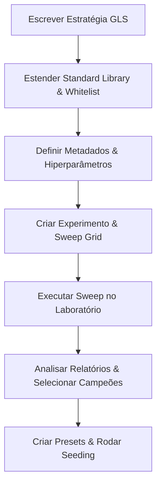

# Guia de Criação, Otimização e Teste de Laboratórios no data-backtest

Este manual descreve o processo ponta a ponta para criar novas estratégias quantitativas, configurar experimentos de otimização (sweeps), testá-las sob a arquitetura de alto desempenho `chunked-1d` (fatiamento diário) e disponibilizá-las no Studio do Backtest.

---

## 🏗️ Fluxo de Trabalho do Laboratório



---

## 1. Escrevendo a Lógica em GLS (GoldenLens Script)

Toda nova estratégia de alta performance deve ser escrita em **GLS** para que possa ser compilada em Struct-of-Arrays (SOA) e executada em workers paralelos.

1. Crie o arquivo fonte em: `src/backtestStudio/gls/strategies/NomeDaEstrategia.gls`
2. Estruture a estratégia usando parâmetros padrão (`param`), variáveis de estado persistentes (`state.xxx`) e ganchos de eventos:
   ```javascript
   strategy "Minha Estrategia GLS" {
     param walletSize = 100
     param meuLimite = 20

     onEventStart(event) {
       state.entered = false
       state.minhaVariavel = 0.0
     }

     onTick(tick, event) {
       if (!state.entered) {
         let sinal = model.scoreMinhaEstrategia(samples, tick, event, params)
         if (sinal.best) {
           let comprado = enter(sinal.best.side, { price: sinal.best.ask, budget: 15, reason: "entrada" })
           if (comprado) {
             state.entered = true
           }
         }
       }
     }

     onEventEnd(event) {
     }
   }
   ```

> [!WARNING]
> **Restrição de Compilação (Reatribuição de Let)**:
> O compilador SOA do Studio proíbe a reatribuição de variáveis locais normais (ex: `let a = 1; a = a + 1;`) para otimizar os registradores JS. 
> * **Errado**:
>   ```javascript
>   let sideSign = 1.0
>   if (side == "DOWN") { sideSign = -1.0 }
>   ```
> * **Correto** (use expressões aritméticas ou condicionais em linha):
>   ```javascript
>   let sideSign = (side == "UP") * 2.0 - 1.0
>   ```

---

## 2. Estendendo a Biblioteca Padrão (Standard Library)

Se a estratégia necessitar de indicadores matemáticos ou modelos de probabilidade complexos em JavaScript, estenda a Standard Library.

### A. Adicionar Métodos Matemáticos/Lógicos
Abra o arquivo [standardLibrary.js](file:///d:/Projetos/projeto-goldenlens/data-backtest/src/backtestStudio/gls/standardLibrary.js) and insira a lógica desejada dentro de `createStandardLibrary`:
```javascript
export function createStandardLibrary() {
  const lib = {
    // ...
    model: {
      scoreMinhaEstrategia(samples, tick, event, params = {}) {
        // Lógica de cálculo aqui
      }
    }
  };
  return lib;
}
```

> [!IMPORTANT]
> **Compatibilidade de Ticks nos Workers**:
> No modo de alta performance (workers paralelos), o array `samples` contém snapshots colunares eficientes do DuckDB.
> * **Não acesse** propriedades com camelCase e sem fallback (ex: `sample.underlyingPrice` ou `sample._tsMs`).
> * **Sempre use** as funções auxiliares com fallbacks de tipo:
>   ```javascript
>   const price = sampleUnderlying(sample, fallbackValue);
>   const timestamp = sample._tsMs ?? timestampMs(sample.ts);
>   ```

### B. Registrar na Whitelist do Validador
Para que o validador estático do Studio não aponte erros de compilação, você **deve** registrar as novas funções no catálogo de permissões em [blocks.js](file:///d:/Projetos/projeto-goldenlens/data-backtest/src/backtestStudio/gls/blocks.js):
```javascript
export const BLOCK_CATALOG = {
  // ...
  model: ['directionProbability', 'scoreSides', 'scoreMinhaEstrategia'],
};
```

---

## 3. Metadados e Esquemas do Laboratório

Crie a estrutura de pastas da estratégia em `labs/strategies/<family>/<strategy-id>/`. 
Exemplo para `labs/strategies/minha-familia/minha-estrategia/`:

* **`strategy.json`**: Metadados que mapeiam a estratégia para o arquivo GLS:
  ```json
  {
    "id": "minha-estrategia",
    "name": "Minha Estrategia",
    "family": "minha-familia",
    "status": "candidate",
    "kind": "gls",
    "assets": ["BTC"],
    "intervals": ["5m"],
    "requiresBook": true,
    "defaultBookDepth": 25,
    "source": {
      "type": "file",
      "path": "src/backtestStudio/gls/strategies/NomeDaEstrategia.gls"
    }
  }
  ```
* **`defaults.json`**: Parâmetros iniciais default da estratégia.
* **`params.schema.json`**: Esquema com os tipos e regras dos parâmetros.

---

## 4. Configurando o Experimento (Sweeps)

Os sweeps testam dezenas de combinações de parâmetros (grid-search) em paralelo para encontrar o modelo campeão.

### A. Criar o Search Space
Crie um arquivo em `labs/strategies/<family>/<strategy-id>/search-spaces/grid-search.json`:
```json
{
  "name": "grid-search",
  "description": "Exploração dos limites e sensibilidade da estratégia",
  "grid": {
    "meuLimite": [10, 20, 30],
    "outroParametro": [0.02, 0.05]
  }
}
```

### B. Criar o Experimento
Crie um arquivo em `labs/strategies/<family>/<strategy-id>/experiments/nome-do-experimento.json`:
```json
{
  "name": "btc-5m-meu-sweep",
  "strategyId": "minha-estrategia",
  "strategyFamily": "minha-familia",
  "dataset": "backtest_ticks",
  "underlying": "BTC",
  "interval": "5m",
  "bookDepth": 25,
  "from": "2026-05-04",
  "to": "2026-06-12",
  "engine": "soa",
  "glsExecution": "compiled-soa",
  "fastRun": true,
  "variantWorkers": 4,
  "dailyMetrics": true,
  "defaults": "../defaults.json",
  "searchSpace": "../search-spaces/grid-search.json",
  "metrics": ["totalPnl", "entries", "winRate", "profitFactor", "maxDrawdown"]
}
```

> [!TIP]
> **dailyMetrics: true**
> A definição de `"dailyMetrics": true` força a divisão do processamento em pacotes diários. Isto ativa a arquitetura colunar ultrarrápida no Windows e permite calcular consistência diária de forma precisa.

---

## 5. Executando e Analisando o Sweep

Rode o sweep de otimização pelo console informando o arquivo do experimento:
```powershell
npm run lab:run -- --experiment labs/strategies/minha-familia/minha-estrategia/experiments/nome-do-experimento.json --variant-workers 4
```

### O que acontece durante a execução?
1. O runner valida os dados do DuckDB locais correspondentes ao período solicitado (`from` a `to`).
2. Multiplica o Grid (ex: 3 * 2 = 6 variantes * 40 dias = 240 jobs).
3. Executa em paralelo usando workers de threads, processando milhões de ticks por segundo.
4. Gera um relatório em: `reports/labs/minha-estrategia/timestamp-btc-5m-meu-sweep/report.json`.

---

## 6. Disponibilizando como Preset no Backtest Studio

Uma vez identificada a variante campeã (melhor PnL, maior Profit Factor e menor Drawdown), registre-a no banco do Studio para que ela possa ser rodada na interface visual.

1. Crie a pasta de presets em `labs/strategies/<family>/<strategy-id>/presets/`.
2. Crie o `manifest.json` para registrar os presets disponíveis:
   ```json
   {
     "strategyId": "minha-estrategia",
     "updatedAt": "2026-06-14",
     "presets": [
       { "id": "v1", "role": "champion" }
     ]
   }
   ```
3. Crie os arquivos de preset (ex: `v1.json`):
   ```json
   {
     "id": "v1",
     "name": "v1 (Nome Do Preset)",
     "studioSlug": "me-v1",
     "studioName": "Minha Estrategia · v1",
     "role": "champion",
     "description": "Variante campeã com melhor expectativa risk/reward encontrada no sweep.",
     "tags": ["champion", "depth25"],
     "labVariantId": "v0005",
     "labSummary": {
       "totalPnl": 383.47,
       "profitFactor": 2.20,
       "entries": 214
     },
     "params": {
       "walletSize": 100,
       "meuLimite": 20
     }
   }
   ```
4. Crie uma rotina de seeding em: `src/backtestStudio/gls/seedMinhaEstrategiaPresets.js` (copie a estrutura de `seedImpulseElasticityPresets.js` adaptando os nomes).
5. Registre a chamada de seeding no script global `labs/cli/seed-presets.js`:
   ```javascript
   import { seedMinhaEstrategiaPresets } from '../../src/backtestStudio/gls/seedMinhaEstrategiaPresets.js';
   // ...
   const seededMinha = seedMinhaEstrategiaPresets(db);
   ```
6. Execute o seed pelo console:
   ```powershell
   npm run lab:seed-presets
   ```
7. Para forçar a validação em todas as versões antigas no banco SQLite local, rode o script utilitário de revalidação:
   ```powershell
   node scratch/revalidate-all.js
   ```

A estratégia e suas versões correspondentes a presets agora aparecerão perfeitamente limpas e validadas no Studio!
