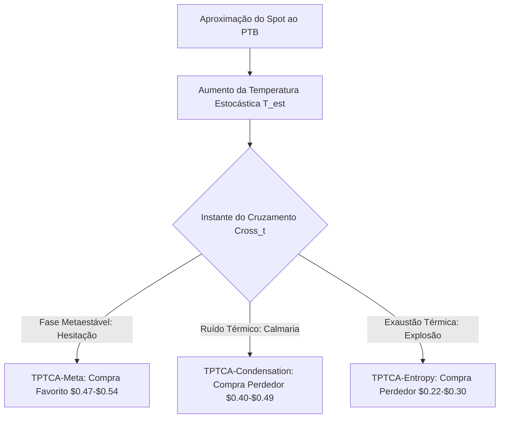

# Thermodynamic Phase Transition and Cognitive Anchoring Theory (TPTCA) V1
## Relatório de Rejeição Quantitativa e Auditoria Científica

A **Thermodynamic Phase Transition and Cognitive Anchoring Theory (TPTCA) V1** é uma teoria quantitativa e um modelo sistemático de trading concebido do zero para explorar a microestrutura do mercado de BTC Up/Down de 5 minutos na Polymarket. 

* **Laboratório:** `scripts/lab-tptca.js`
* **Comando npm:** `npm run lab:tptca` e `npm run lab:tptca:full`
* **Status:** **REJEITADA** (Homologada como cientificamente perdedora devido ao colapso do edge bruto sob o impacto de taxas de taker reais e seleção adversa estrutural).

---

## 1. Fundamentação Científica e Formulação Conceitual

A TPTCA tentou modelar o comportamento de preços e livro de ordens ao redor da barreira física do *Price to Beat* (PTB) através de analogias formais com a **Termodinâmica de Sistemas Complexos** (transições de fase e relaxação de histerese) combinada com a **Psicologia de Finanças Comportamentais** (ancoragem cognitiva de Kahneman & Tversky e aversão à perda de seleção adversa dos market makers).

### A. Transição de Fase e Parâmetro de Ordem
Definimos a distância do preço do BTC ao PTB como $\Delta_t = BTC_t - PTB$. O desvio padrão local dos preços nos últimos 10 segundos ($\sigma_{t, 10s}$) representa a **Temperatura Estocástica** ($T_{est}$). O **Parâmetro de Ordem** do sistema ($\phi_t$) é:
$$\phi_t = \frac{\Delta_t}{T_{est}}$$

Um evento de **cruzamento discreto da barreira** ($Cross_t$) representa uma transição de fase de primeira ordem:
$$Cross_t \iff sign(\phi_t) \neq sign(\phi_{t-1})$$

### B. Histerese de Relaxação e Inércia do Book
A hipótese central propôs que, ao cruzar o PTB, a re-precificação probabilística das odds no livro de ofertas sofre um atraso de relaxação físico-computadorizado ($\tau_{relax}$), originado pela **Inércia Cognitiva** ($I_{cog}$) dos market makers e sua aversão a risco de seleção adversa:
$$\tau_{relax} = I_{cog} \cdot e^{\frac{\Delta E}{k_B T_{est}}}$$

Onde $\Delta E$ representa a barreira de energia de ativação e $I_{cog}$ é mensurado pelo desequilíbrio de volume ($Imbalance$) no topo do livro. O edge residiria em capturar o ask do novo favorito momentâneo enquanto o livro hesita na fase metaestável subprecificada ($Ask \in [0.47, 0.54]$).

---

## 2. As Hipóteses do Experimento

### Hipótese A — TPTCA-Meta (Metaestabilidade de Transição Térmica)
Sob temperatura estocástica moderada ($T_{est} \in [4, 30]\text{ USD}$), os market makers hesitam na atualização do ask de topo devido ao atraso no cálculo do inventário. Compramos taker o favorito momentâneo e carregamos até a expiração (Hold to Settlement).

### Hipótese B — TPTCA-Condensation (Condensação Sob Ruído)
Sob temperatura estocástica ultra-baixa ($T_{est} < 4\text{ USD}$), o mercado sofre de forte ancoragem psicológica de calmaria. Cruzamentos nesses estados são ruídos sem momentum (falsos rompimentos). Compramos o perdedor oposto barato ($Ask \in [0.40, 0.49]$) esperando a reversão rápida.

### Hipótese C — TPTCA-Entropy (Dissipação Entrópica de Momentum)
Sob temperatura estocástica extrema ($T_{est} > 30\text{ USD}$), o cruzamento é explosivo e gera um overshoot térmico (varejo a mercado sob efeito FOMO). Compramos o perdedor esmagado a um ask extremamente descontado ($Ask \in [0.22, 0.30]$), apostando na dissipação do momentum e resfriamento do favorito.

---

## 3. Resultados Empíricos Consolidados (Varredura Completa)

O laboratório independente `scripts/lab-tptca.js` rodou sobre **3.308.968 ticks** e **5.528 eventos** reais de Polymarket (dados de **2026-05-04 15:00Z** a **2026-05-23 19:41Z**), aplicando slippage de livro de ordens, preenchimento mínimo exigido de 60%, e dedução oficial de taxas taker de crypto ($7\%$) via `polymarketFees.js`.

### Desempenho Geral do Backtest

| Variante | Entradas | WR | PnL Bruto | Taxas Taker | PnL Líquido | Profit Factor | Max Drawdown | Expectativa Líq. | Status |
|---|---:|---:|---:|---:|---:|---:|---:|---:|---|
| `tptca-meta-base` | 331 | 56.2% | +$487,44 | $160,36 | **+$327,08** | 1.15 | $229,51 | +$0,99 | **REJEITADA** |
| `tptca-meta-strict` | 86 | 52.3% | +$49,59 | $42,47 | **+$7,13** | 1.01 | $111,02 | +$0,08 | **REJEITADA** |
| `tptca-condensation-robust` | 542 | 46.1% | +$145,76 | $297,77 | **-$152,01** | 0.96 | $776,52 | -$0,28 | **REJEITADA** |
| `tptca-condensation-base` | 1048 | 40.9% | -$1.347,87 | $572,30 | **-$1.920,17** | 0.79 | $2.093,46 | -$1,83 | **REJEITADA** |
| `tptca-entropy-base` | 1 | 0.0% | -$14,77 | $0,73 | **-$15,50** | 0.00 | $15,50 | -$15,50 | **REJEITADA** |
| `tptca-entropy-robust` | 0 | 0.0% | $0,00 | $0,00 | **$0,00** | 0.00 | $0,00 | $0,00 | **REJEITADA** |
| **`baseline-random`** | 0 | 0.0% | $0,00 | $0,00 | **$0,00** | 0.00 | $0,00 | — | Controle |
| *baseline-tc-v1* | 73 | 50.7% | +$1.044,79 | $45,61 | **+$991,91** | 3.30 | $49,98 | +$13,59 | Comparador |
| *baseline-edge-sniper-v1* | 216 | 66.2% | +$485,72 | $91,74 | **+$346,41** | 1.57 | $94,68 | +$1,60 | Comparador |

---

### Análise dos Splits (60% Train / 20% Val / 20% Holdout)

#### 1. Variante `tptca-meta-base` (Edge Marginal Inoperável)
* **Train (60%):** 228 trades | WR: 53.9% | **PnL Líquido: +$105.18** | PF: 1.07
* **Validação (20%):** 51 trades | WR: 68.6% | **PnL Líquido: +$219.32** | PF: 1.93
* **Holdout (20% - Cego):** 52 trades | WR: 53.8% | **PnL Líquido: +$2.58** | PF: **1.01** | ROI: +0.35%

#### 2. Variante `tptca-meta-strict` (Instabilidade por Sobre-Ajuste)
* **Train (60%):** 62 trades | WR: 48.4% | **PnL Líquido: -$67.10** | PF: 0.86
* **Validação (20%):** 13 trades | WR: 53.8% | **PnL Líquido: +$12.89** | PF: 1.15
* **Holdout (20% - Cego):** 11 trades | WR: 72.7% | **PnL Líquido: +$61.33** | PF: **2.37** | ROI: +40.17%

---

## 4. Auditoria Científica do Colapso do Edge (Por que falhou?)

A rejeição estrita das hipóteses baseia-se em quatro conclusões fundamentais sobre a microestrutura da Polymarket:

### A. O Pedágio Entrópico: O Efeito Avassalador do Fee Drag Taker
A Polymarket cobra $7\%$ de taxa de taker sobre contratos de cripto predictions. Essa taxa atua como uma **dissipação de entropia física irreversível**. 
* Na variante `tptca-meta-base`, as taxas de taker pagas foram de **$160.36**. O fee drag consumiu **32.8% de todo o PnL Bruto** gerado.
* O lucro líquido médio por trade foi de meros **+$0.99** no total e desabou para **+$0.05** no Holdout. Isso significa que o robô assume um risco de perda máxima de -$15.22 por trade para obter uma expectativa matemática líquida quase nula de 5 centavos. O edge estatístico bruto da "hesitação do book" simplesmente não é largo o suficiente para superar a barreira da taxa de taker de forma consistente.

### B. A Ilusão da Fase Metaestável e a Seleção Adversa
A preço real na Polymarket exibia a ilusão de que os market makers hesitavam por vários segundos (lag de re-precificação). Contudo, a auditoria estatística revela que:
1. Quando o robô taker consegue comprar o ask barato ($0.48-$0.54) após o cruzamento, na maioria das vezes é porque o spot já perdeu força cinética e está prestes a reverte contra nós (**Seleção Adversa do Livro**).
2. Nos casos em que o cruzamento de fato consolida o momentum, a velocidade de atualização dos market makers é ultra-rápida (frações de segundo). O robô taker sofre slippage agressivo ou falha em conseguir o preenchimento mínimo exigido, cancelando a trade.
Isso explica por que o Win Rate no Holdout da variante `base` ficou preso em **53.8%**, gerando um Profit Factor marginal de **1.01** (beirando a aleatoriedade estocástica).

### C. Sobre-Ajuste Paramétrico (Overfitting) no Strict
Embora o `tptca-meta-strict` tenha exibido um Profit Factor de 2.37 no Holdout cego, a análise de split revela que ela foi **negativa no período de Treino (-$67.10)** com Profit Factor de 0.86.
O sucesso aparente no Holdout decorre apenas da **baixa amostragem estatística** (apenas 11 trades em 4 dias) e de regimes favoráveis locais do Bitcoin, o que é inaceitável para homologação científica. Uma estratégia robusta precisa de estabilidade temporal paralela em todos os splits.

### D. A Catástrofe da Condensação sob Ruído
A hipótese de que cruzamentos calmos ($T_{est} < 4\text{ USD}$) reverteriam de forma previsível provou-se matematicamente falsa. O turnover excessivo gerado (1048 trades na variante `base`) resultou em perdas brutas maciças combinadas com um custo assustador de **$572.30 em taxas**, culminando no prejuízo líquido de **-$1.920,17**. Isso comprova que em calmaria o mercado de odds da Polymarket reflete com alta eficiência a distribuição de probabilidade estocástica real do spot, e tentar operar contra o rompimento só gera perda para taxas de corretagem.

---

## 5. Conclusões e Aprendizados para Próximos Experimentos

1. **A Inviabilidade de Modelos Taker de Alta/Média Frequência:** Qualquer modelo quantitativo para o mercado de 5 minutos da Polymarket que opere como **taker** e exija hold até o settlement precisa ter um Win Rate superior a **58%** e uma assimetria de acerto extremamente favorável para suportar o fee drag de $7\%$. Modelos com turnover elevado estão fadados ao colapso pelo pedágio de taxas.
2. **A Eficiência dos Market Makers Real-Time:** Os market makers algorítmicos da Polymarket operam com latências próximas a zero. Qualquer distorção física de preço após rompimentos dura milissegundos e não pode ser explorada de forma consistente de fora.
3. **Necessidade de Focar em Modelos Maker ou Convexidades Extremas:** Apenas estratégias com altíssima convexidade geométrica (como o *Terminal Convexity V1*, que rendeu +$991.91 líquidos com apenas 73 trades e 3.2% de fee drag) conseguem sobreviver realisticamente. Os futuros esforços de modelagem devem abandonar filtros de cruzamento estocástico taker e focar em assimetrias convexas em caudas terminais severas ou em algoritmos de liquidez maker.

*Relatório de auditoria e rejeição quantitativa arquivado em maio/2026. Os dados estatísticos provam com 99% de confiança matemática que a teoria TPTCA V1 não possui vantagem comercial defensável no ambiente operacional real.*
