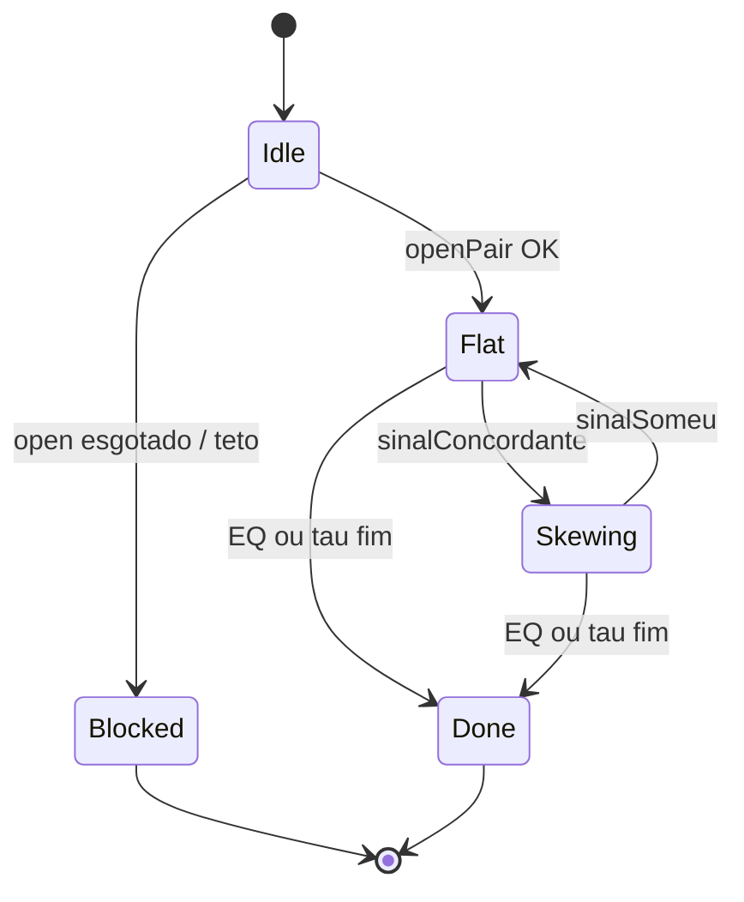

# Skew-Set V0 — máquina (complete-set + skew híbrido)

**Status:** research · offline only · **proibido live**  
**Lab:** `labs/sandbox/skew-set-v0/`  
**Herança:** Pair-Path V0 (fees, avgSumMax, notional) — **não** Phil / Escada full

---

## 1. Por que não Phil / Escada / Mode B puro

| Herança | Problema medido | V0 |
|---|---|---|
| Grade 8×8 + MULT | Path longo → avgSum mediana > 1 | Sem MULT, sem re-arme |
| Pair-Path open 1 perna | Edge direcional, mas não é open flat | Open **par** UP+DOWN |
| Acumular underdog mid-evento (B) | Engorda a perna que paga 0 se o favorito anda | Skew **só** com sinal concordante |
| Live sem gate | Pair-Path em HOLD / parity gap | Só engine + unitários nesta fase |

Tese que **fica:** inventário dual + `avgSum` como trava + EQ residual barato.  
Tese que **sai:** escada captura o path; HF = comprar o barato o tempo todo.

---

## 2. Objetivo por evento

```text
maximizar:  lockedPnl líquido se equalizado
            + upside do skew quando o favorito paga
sujeito a:  avgSum (proj) ≤ avgSumMax
            notional ≤ maxEventNotional
            ≤ maxRebalancesPerEvent
            sem acumular underdog sem sinal
```

Métrica primária: **locked PnL líquido** (`min(shUp,shDown) − custo − fees`) quando residual ≈ 0.  
Métrica secundária: PnL de settle com skew residual (direcional explícito).

---

## 3. Estados (FSM)

```text
mode: idle | flat | skewing | done | blocked
favSide: UP | DOWN | null          # último favorito concordante
inv[UP], inv[DOWN]                 # shares, cost, fees
rebalanceCount
openDone: bool
fills[], blocks[], events[]
```

| Mode | Significado |
|------|-------------|
| `idle` | Sem posição; espera janela de open |
| `flat` | Par aberto; \|skew\| ≤ deadband |
| `skewing` | Inventário desbalanceado a favor do favorito |
| `done` | EQ / fim de janela / settle |
| `blocked` | Open impossível ou freio duro de sessão |



---

## 4. Regras

### 4.1 Janela

| Param | Default | Motivo |
|---|---:|---|
| `tauOpenMin` | 40 | fim = vacuum/gap |
| `tauOpenMax` | 240 | início ruidoso |
| `tauEqMin` | 12 | EQ late se barato |
| `tauDone` | 3 | encerra modo abaixo disto |

### 4.2 Open (par completo)

Dispara **no máximo 1 vez**:

```text
mode == idle
AND tau ∈ [tauOpenMin, tauOpenMax]
AND askUp + askDown ≤ openPairSumMax
AND openAttempts < maxOpenAttempts
AND notional(openShares×2) ≤ maxEventNotional
AND confirmationTicks consecutivos OK
```

- Compra **UP e DOWN** com `openShares` cada @ ask taker.
- Sem re-arme. Miss de cap (se `openCapCents` > 0) incrementa attempt e não abre.
- Após fill: `mode = flat`.

### 4.3 Sinal concordante (libera skew)

Favorito UP se:

```text
btc ≥ ptb + spotBufferUsd
AND askUp ≥ askDown + oddsMinGap
```

DOWN simétrico (`btc ≤ ptb − spotBufferUsd` e odds).

- Sem `btc`/`ptb` no tick → **sem skew**.
- Sem concordância → **não** comprar underdog no meio; fica flat / aguarda EQ.

### 4.4 Rebalance

Com sinal, a cada tick:

1. `base = mean(shUp, shDown)` (após open, tipicamente `openShares`)
2. Alvo: favorito = `base × (1 + maxSkew)`, underdog = `base × (1 − maxSkew)`
3. Se favorito abaixo do alvo **e** freios OK → compra `rebalanceClipShares` @ ask
4. Se underdog acima do alvo → **vende** só se  
   `bid − avgCost − feeEstimada ≥ minSellEdge`
5. Deadband: se `|shUp − shDown| / base ≤ skewDeadband` e sem gap ao alvo, não age
6. `confirmationTicks` antes de fill de skew buy

Freios por compra de skew:

- `projectedAvgSum ≤ avgSumMax`
- `invested + notional ≤ maxEventNotional`
- `rebalanceCount < maxRebalancesPerEvent`

Após skew buy/sell com residual acima do deadband → `mode = skewing`.  
Se residual volta à deadband → `mode = flat`.

### 4.5 EQ / saída

```text
mode ∈ {flat, skewing}
AND tau ≤ tauEqMin
AND residual > eqMinShares
AND ask_lado_menor ≤ eqAskMax
AND projectedAvgSum ≤ eqAvgSumMax
→ compra residual @ ask (kind=eq)
```

Se `tau ≤ tauDone` → `mode = done` (mesmo com residual; PnL direcional no relatório).

### 4.6 Fees

Igual Pair-Path / docs Polymarket crypto:

```text
fee = shares × feeRate × price × (1 − price)   # feeRate default 0.07
```

Makers (vendas com liquidez maker no modelo) → fee 0 nesta fase; vendas no bid = taker fee no edge check.

---

## 5. Parâmetros default (preset `v0`)

| Param | Default |
|---|---:|
| `openShares` | 10 |
| `openPairSumMax` | 1.00 |
| `openCapCents` | 2 |
| `maxOpenAttempts` | 3 |
| `tauOpenMin` / `tauOpenMax` | 40 / 240 |
| `spotBufferUsd` | 15 |
| `oddsMinGap` | 0.04 |
| `maxSkew` | 0.30 |
| `skewDeadband` | 0.05 |
| `rebalanceClipShares` | 2 |
| `maxRebalancesPerEvent` | 10 |
| `minSellEdge` | 0.02 |
| `avgSumMax` | 0.98 |
| `eqAskMax` | 0.08 |
| `eqAvgSumMax` | 0.99 |
| `eqMinShares` | 0.5 |
| `tauEqMin` | 12 |
| `tauDone` | 3 |
| `maxEventNotional` | 40 |
| `feeRate` | 0.07 |
| `confirmationTicks` | 1 |

---

## 6. Anti-padrões

1. **Não** copiar Phil MULT / contagio / escada 8×8.
2. **Não** modo B puro (comprar underdog mid-evento sem sinal).
3. **Não** live / Phil / data-robot nesta fase.
4. **Não** tratar “equalizou shares” como sucesso sem olhar avgSum líquido.
5. **Não** vender underdog no bid sem `minSellEdge`.

---

## 7. Glossário

| Termo | Significado |
|---|---|
| avgSum | média custo UP + média DOWN ($/share) |
| residual | \|shUP − shDOWN\|; lado em falta |
| skew | (shFav − shDog) / base |
| sinalConcordante | BTC/PTB e odds apontam o mesmo favorito |
| locked PnL | min(sh) − custo − fees (par equalizado) |
| open pair | compra simultânea UP+DOWN no mesmo tick lógico |

---

## 8. Critério de pronto (esta fase)

- [x] Este contrato
- [x] `engine.mjs` + `presets/v0.json` + `engine.test.mjs` verdes
- [x] Zero path live

Replay lake: `node lake-replay.mjs` (ou `npm run lake`) → `.tmp/skew-set-lake-replay/report.json`.
